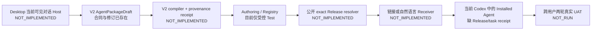

# Combo 研发问题全景审计

> 审计日期：2026-09-01
>
> 审计基线：[`a2a1391f867cb71107465cba29ca9267a636d535`](https://github.com/dangdang-tech/Combo/commit/a2a1391f867cb71107465cba29ca9267a636d535)
>
> 文档性质：公开、只读、证据导向的研发审计；不代表部署、Production 验收或完整用户验收已经完成。

## 1. 结论先行

Combo 不是“整体没有实现”，而是已经形成了三组各自有代码和测试的实现岛：

1. Agent Package 协议与 creator-worker 内核；
2. 旧 Capability/Task/Web Studio 产品线；
3. 受控 Test 的 Agent Package Registry/Runtime。

当前最主要的问题，是三组实现之间缺少 `PROJECT.md` 中 G-001 所要求的关键连接：

因此，当前大量绿色单元测试、模块集成测试、CI、Preview 发布或受控 Test 结果，都不能升级为“创作者从当前对话制作 Agent，其他用户通过链接或自然语言获取，并在自己的当前 Codex 中继续工作”的产品闭环证据。仓库自己的机器可读验收状态也仍是 [`productStatus: BLOCKED`](https://github.com/dangdang-tech/Combo/blob/a2a1391f867cb71107465cba29ca9267a636d535/apps/creator-worker/creator-conversation-acceptance.v1.json#L1-L37)。

这次审计还确认了两项需要维护者优先处置的 P0 级风险：候选构建与受信部署控制面的隔离不足，以及 Preview/Production 数据面与任务执行边界不足。第 4 节分别记录状态、影响和修复设计；为避免在公开仓库形成可直接复用的利用指南，本文不写精确执行链和复现步骤，也不把它们误标为已解决。

## 2. 审计范围与方法

### 2.1 检查范围

- 产品真源：`PROJECT.md`、`ENGINEERING.md`；
- 代码：Web、Authoring、Runtime、creator-worker、协议包、共享包、数据库迁移；
- 质量：单元测试、集成测试、real tests、浏览器测试入口；
- 交付：GitHub Actions、镜像构建、Release manifest、部署与验证脚本；
- 历史：公开 Issue、PR、Actions run、当前 `main` 对应实现；
- 治理：分支保护、开发门禁、文档与代码的一致性。

### 2.2 快照规模

以下数字均按 2026-09-01 审计正文定稿前计算，不包含本报告自己的治理前置 PR 和文档 PR：

| 指标         | 数量 | 说明                                                                               |
| ------------ | ---: | ---------------------------------------------------------------------------------- |
| Git 提交     |  774 | 项目从 2026-06-07 开始快速演进                                                     |
| Git 跟踪文件 |  854 | 含应用、包、基础设施、文档与测试                                                   |
| 主要源码文件 |  612 | `ts/tsx/js/mjs/go/sql/sh`                                                          |
| 测试相关路径 |  216 | `git ls-files` 统计并剔除 README/fixture；宽口径为 226，数量不等于真实用户链路覆盖 |
| SQL 迁移     |   20 | `0000`–`0019`                                                                      |
| GitHub Issue |   51 | 41 closed，10 open                                                                 |
| GitHub PR    |  246 | 218 merged，21 open，7 closed without merge                                        |
| Draft PR     |   12 | 其中一部分是当前 CI 证据链的前置堆栈                                               |

### 2.3 状态口径

严重度中，P0 表示阻塞唯一产品目标、信任边界或发布安全，P1 表示应在扩展/通用化前解决的重要缺口，P2 表示不阻塞最小闭环但会持续增加维护成本的问题。`P0/P1` 表示问题在通用产品路径是 P0，而在当前 fixed/controlled gate 下暴露面暂时降为 P1；不是两个结论任选其一。

| 状态               | 含义                                                   |
| ------------------ | ------------------------------------------------------ |
| `NOT_IMPLEMENTED`  | 产品所需能力在当前基线没有实现                         |
| `NOT_RUN`          | 能力可能有局部实现，但目标环境/用户路径没有执行验收    |
| 部分实现           | 核心模块存在，必要连接、边界或真实验收仍缺失           |
| 已修复，验收不足   | 代码修复已合并，但真实规模、目标环境或跨用户证据不足   |
| 已修复且有真实证据 | 修复、版本和相关真实环境证据能够互相绑定               |
| 技术债             | 当前可工作，但模型分叉、扩展性、治理或维护成本持续累积 |

本报告严格区分“代码已开发、测试通过、CI 通过、已合并、已部署、浏览器验收、真实用户闭环”。其中任一层的证据不能替代下一层。

## 3. 当前产品与架构问题

### P-01 · P0 · Desktop 当前对话 Host 未实现

J-011 要求创作者只发一句自然语言，让系统读取当前顶层 Codex 任务中的可见对话，并且不能读取 Project、原始 session 文件或要求用户打开 Terminal。当前机器状态明确写着 Unit/Security/Host 为 `NOT_IMPLEMENTED`、Contract/UAT 为 `NOT_RUN`，`candidateCommit` 为空；生产 composition 绑定的仍是 unavailable host，只能诚实地 fail closed。

- 证据：[`creator-conversation-acceptance.v1.json`](https://github.com/dangdang-tech/Combo/blob/a2a1391f867cb71107465cba29ca9267a636d535/apps/creator-worker/creator-conversation-acceptance.v1.json#L10-L79)
- 证据：[`unavailable-current-conversation-draft-host.ts`](https://github.com/dangdang-tech/Combo/blob/a2a1391f867cb71107465cba29ca9267a636d535/apps/creator-worker/src/application/unavailable-current-conversation-draft-host.ts#L1-L12)
- 证据：production composition 将 ambient Host 固定为 unavailable：[`agent-package-current-conversation-composition.ts`](https://github.com/dangdang-tech/Combo/blob/a2a1391f867cb71107465cba29ca9267a636d535/apps/creator-worker/src/application/agent-package-current-conversation-composition.ts#L11-L32)
- 影响：G-001 的入口尚不存在；旧 Project/CLI/Hook/Bridge 证据不能代替当前对话 Host。
- 建议：实现 Desktop 可信端口和 Host receipt，绑定当前可见 task/conversation；用文件观测证明零 Project、零 raw session 读取。

### P-02 · P0 · V2 当前对话 Draft 不能编译成 Package

V2 Draft 已支持读取和修订，但任务没有 compile；现有 builder 仍只接受 V1，并写死 `sourceKind: current_project`。测试甚至明确锁定 V2 build 应失败，说明这里是诚实的合同边界，不是一个隐藏完成的功能。

- 证据：[`agent-package-current-conversation-draft.ts`](https://github.com/dangdang-tech/Combo/blob/a2a1391f867cb71107465cba29ca9267a636d535/apps/creator-worker/src/application/agent-package-current-conversation-draft.ts#L20-L114)
- 证据：[`agent-package-builder.ts`](https://github.com/dangdang-tech/Combo/blob/a2a1391f867cb71107465cba29ca9267a636d535/apps/creator-worker/src/authoring/agent-package-builder.ts#L66-L83)
- 证据：[`creator-agent-protocol/README.md`](https://github.com/dangdang-tech/Combo/blob/a2a1391f867cb71107465cba29ca9267a636d535/packages/creator-agent-protocol/README.md#L59-L65)
- 证据：测试明确要求 V2 被旧 compiler 拒绝：[`agent-package-authoring.test.ts`](https://github.com/dangdang-tech/Combo/blob/a2a1391f867cb71107465cba29ca9267a636d535/apps/creator-worker/src/__tests__/agent-package-authoring.test.ts#L135-L168)
- 影响：用户可见的修订无法进入不可变 Package，也无法形成 exact draft revision → package digest 的证据链。
- 建议：新增隔离的 V2 compiler/provenance receipt，将 draft id、revision、fingerprint、compiler version 与 package digest 一次性绑定。

### P-03 · P0 · Web Studio 操作的是旧 Capability UI Artifact

当前 Web 路由没有 AgentPackageDraft 审阅页；Capabilities 页面按 `capabilityId` 启动 Studio，Runtime 的 `STUDIO_PROTOCOL` 修改的是 Miniapp UI Artifact，Release 页面中的“继续调整 UI”也回到旧 Studio。它不是 J-020 要求的“审阅 Agent 身份、能力、来源、真实试跑、修订后重新编译”。

- 证据：[`routes.ts`](https://github.com/dangdang-tech/Combo/blob/a2a1391f867cb71107465cba29ca9267a636d535/apps/web/src/shell/routes.ts#L17-L21)、[`App.tsx`](https://github.com/dangdang-tech/Combo/blob/a2a1391f867cb71107465cba29ca9267a636d535/apps/web/src/App.tsx#L36-L54)
- 证据：[`CapabilitiesPage.tsx`](https://github.com/dangdang-tech/Combo/blob/a2a1391f867cb71107465cba29ca9267a636d535/apps/web/src/pages/capabilities/CapabilitiesPage.tsx#L88-L103)
- 证据：[`build-agent.ts`](https://github.com/dangdang-tech/Combo/blob/a2a1391f867cb71107465cba29ca9267a636d535/apps/runtime/src/modules/agent/build-agent.ts#L41-L61)
- 影响：产品表面沿用“设计生成物 UI”的旧对象，无法保证用户正在修改 exact Agent Draft。
- 建议：建立绑定 draft revision 和 compiler result 的独立 Agent Studio，不复用 Artifact UI Studio 的语义。

### P-04 · P0 · creator-worker 尚未接入 Authoring/Web/Registry 产品路径

Authoring 只依赖协议包，不依赖 creator-worker。发布 API 接受调用方组装的 base64 manifest、`AGENT.md`、skill 和 bundle，缺少 Draft id/revision/fingerprint；路由又只在受控 Test gate 安装。

- 证据：[`apps/authoring/package.json`](https://github.com/dangdang-tech/Combo/blob/a2a1391f867cb71107465cba29ca9267a636d535/apps/authoring/package.json#L19-L44)
- 证据：[`agent-package-release/service.ts`](https://github.com/dangdang-tech/Combo/blob/a2a1391f867cb71107465cba29ca9267a636d535/apps/authoring/src/modules/agent-package-release/service.ts#L52-L65)
- 证据：[`authoring/bootstrap/routes.ts`](https://github.com/dangdang-tech/Combo/blob/a2a1391f867cb71107465cba29ca9267a636d535/apps/authoring/src/bootstrap/routes.ts#L33-L35)
- 影响：存在内核，也存在发布模块，但没有 Draft → Authoring API → Registry 的产品级 E2E。
- 建议：增加持久 AuthoringTask/Draft repository 与 compiler service；发布只能引用 exact compiled digest，产品路径不再接收任意调用方整包 bytes。

### P-05 · P0 · Registry/Runtime 仍是固定受控 Test，而非通用发布

Authoring 与 Runtime 环境配置都锁定单一 publisher、capability、release 和 package；数据库的 release scope 也只有 `controlled_test`。这些实现与模块测试证明固定受控 Package 的代码路径存在；它们不证明共享 Test 已部署或运行，也没有证明普通创作者能发布。

- 证据：[`authoring env.ts`](https://github.com/dangdang-tech/Combo/blob/a2a1391f867cb71107465cba29ca9267a636d535/apps/authoring/src/platform/config/env.ts#L93-L137)
- 证据：[`0017_agent_package_registry.sql`](https://github.com/dangdang-tech/Combo/blob/a2a1391f867cb71107465cba29ca9267a636d535/db/migrations/0017_agent_package_registry.sql#L24-L49)
- 证据：[`runtime env.ts`](https://github.com/dangdang-tech/Combo/blob/a2a1391f867cb71107465cba29ca9267a636d535/apps/runtime/src/platform/config/env.ts#L195-L261)
- 影响：受控 Test 不能被描述为 J-030/J-040 的通用 Registry、分享和获取能力。
- 建议：设计 production publisher claims、authorization 和 release scopes；env allowlist 只保留 seed/Test 用途。

### P-06 · P0/P1 · Package 全局去重与单一 owner 被错误耦合

Registry 以 `package_digest` 为主键，同时 marker 只有一个 `owner_user_id`。如果两名创作者合法生成完全相同的 bytes，第二位创作者会因 first-writer owner 冲突而失败。当前单 publisher gate 只是掩盖了这个模型问题。

- 证据：[`0017_agent_package_registry.sql`](https://github.com/dangdang-tech/Combo/blob/a2a1391f867cb71107465cba29ca9267a636d535/db/migrations/0017_agent_package_registry.sql#L8-L19)
- 证据：[`agent-package-release/service.ts`](https://github.com/dangdang-tech/Combo/blob/a2a1391f867cb71107465cba29ca9267a636d535/apps/authoring/src/modules/agent-package-release/service.ts#L194-L212)
- 影响：内容寻址的全局去重被解释成内容所有权独占，通用发布后会形成跨用户冲突。
- 建议：Package marker 对 owner 中立；另建多对多 publisher/owner claims，或把 owner 只放在 Release 上。

### P-07 · P0 · 没有公开 exact Release resolver/download

Authoring 只有 POST 和 owner-authenticated GET，没有匿名 exact Release 解析和 Package byte download；Runtime 路由只覆盖 Capability/Session/Artifact。当前 `/a/:slug` 公共页依赖硬编码 mock 与 localStorage preview。

- 证据：[`agent-package-release/routes.ts`](https://github.com/dangdang-tech/Combo/blob/a2a1391f867cb71107465cba29ca9267a636d535/apps/authoring/src/modules/agent-package-release/routes.ts#L182-L205)
- 证据：[`runtime/bootstrap/routes.ts`](https://github.com/dangdang-tech/Combo/blob/a2a1391f867cb71107465cba29ca9267a636d535/apps/runtime/src/bootstrap/routes.ts#L10-L24)
- 证据：[`publicApi.ts`](https://github.com/dangdang-tech/Combo/blob/a2a1391f867cb71107465cba29ca9267a636d535/apps/web/src/pages/public/publicApi.ts#L157-L207)
- 影响：分享链接无法解析成不可变 Package，接收方也无法校验 exact digest。
- 建议：提供 immutable release ref resolver、byte download、integrity endpoint；公共 projection 必须由 exact Package 派生。

### P-08 · P0/P1 · 多套“发布与分享真相”并存

旧 Capability publish/unpublish、随机 share token、Web localStorage “release”、多代 release/share 表，与新 AgentPackageRelease 同时存在。旧路径可以工作，但它的产品对象、权限和分享身份与 G-001 不同。

- 证据：[`capability/routes.ts`](https://github.com/dangdang-tech/Combo/blob/a2a1391f867cb71107465cba29ca9267a636d535/apps/authoring/src/modules/capability/routes.ts#L19-L44)
- 证据：[`releaseDraft.ts`](https://github.com/dangdang-tech/Combo/blob/a2a1391f867cb71107465cba29ca9267a636d535/apps/web/src/pages/release/releaseDraft.ts#L1-L126)
- 证据：[`db/README.md`](https://github.com/dangdang-tech/Combo/blob/a2a1391f867cb71107465cba29ca9267a636d535/db/README.md#L19-L38)
- 影响：同一个“发布”词可能指 local preview、Capability share 或 immutable Package Release，导致代码、文档和验收相互替代。
- 建议：把旧路径明确标为 compatibility；只允许由 AgentPackageRelease 投影旧读模型，逐步迁移并移除旧写入口和 local “release”命名。

### P-09 · P0 · 没有链接/自然语言 Receiver 与安装交接

仓库没有 Receiver/install 模块。native session 需要调用方提供本机绝对 `packagePath` 和 `projectPath`，composition 只是 local loader + bundled host。

- 证据：[`agent-package-session.ts`](https://github.com/dangdang-tech/Combo/blob/a2a1391f867cb71107465cba29ca9267a636d535/apps/creator-worker/src/application/agent-package-session.ts#L33-L79)
- 证据：[`agent-package-composition.ts`](https://github.com/dangdang-tech/Combo/blob/a2a1391f867cb71107465cba29ca9267a636d535/apps/creator-worker/src/application/agent-package-composition.ts#L11-L23)
- 影响：J-040/J-045 的链接获取、自然语言获取、digest 校验、当前 focused Project 安装都不存在。
- 建议：实现 Desktop/Plugin Receiver：resolve → download → digest verify → atomic materialize → current Project handoff → install receipt。

### P-10 · P0 · Server Pi Agent 与 native Codex Session 是两种运行模型

Runtime 使用 `@earendil-works/pi-agent-core` 在服务端创建自己的 message history；受控 resolver 把 Package 内容拼成 instructions。creator-worker 则自行创建一个新的 bundled Codex thread。两条线各有测试，但没有一条证明 exact Release 被加载到使用者当前 Codex task。

- 证据：[`apps/runtime/package.json`](https://github.com/dangdang-tech/Combo/blob/a2a1391f867cb71107465cba29ca9267a636d535/apps/runtime/package.json#L18-L25)
- 证据：[`runtime/build-agent.ts`](https://github.com/dangdang-tech/Combo/blob/a2a1391f867cb71107465cba29ca9267a636d535/apps/runtime/src/modules/agent/build-agent.ts#L200-L232)
- 证据：[`knowledge-agent/resolver.ts`](https://github.com/dangdang-tech/Combo/blob/a2a1391f867cb71107465cba29ca9267a636d535/apps/runtime/src/modules/knowledge-agent/resolver.ts#L253-L280)
- 影响：Web preview 可以工作，却不能因此称为“Installed Agent in current Codex”。
- 建议：明确 Host 边界；Web preview 可独立，G-001 消费必须走 native Receiver/Codex Host 并留下 exact-release evidence。

### P-11 · P1 · native Agent Session 缺 Release/task 绑定与恢复模型

session 输入只有 package path/project path；输出没有 releaseId、installation id、Desktop task/thread receipt。每次都新建 host/thread，也没有持久化、幂等安装、恢复、撤销或升级规则。

- 证据：[`agent-package-session.ts`](https://github.com/dangdang-tech/Combo/blob/a2a1391f867cb71107465cba29ca9267a636d535/apps/creator-worker/src/application/agent-package-session.ts#L33-L45)
- 证据：[`agent-package-session.ts`](https://github.com/dangdang-tech/Combo/blob/a2a1391f867cb71107465cba29ca9267a636d535/apps/creator-worker/src/application/agent-package-session.ts#L117-L127)
- 影响：即使本地包可运行，也无法回答“哪个 Release 安装到了哪个用户 Project/task，恢复后是否仍是同一份内容”。
- 建议：建立 InstalledAgent/AgentSession receipt，锁定 release、digest、consumer project commitment、Desktop task/thread。

### P-12 · P0/P1 · 通用发布缺少秘密、PII 与来源泄露扫描

发布服务验证 canonical bytes、成员、长度和 digest 后即写入不可变对象存储；协议的 unsafe text 检查主要处理控制字符与畸形文本，不验证凭证、PII 或来源真实性。固定 Test gate 降低了当前暴露面，但通用发布前这是阻塞项。

- 证据：[`agent-package-release/service.ts`](https://github.com/dangdang-tech/Combo/blob/a2a1391f867cb71107465cba29ca9267a636d535/apps/authoring/src/modules/agent-package-release/service.ts#L285-L419)
- 证据：[`primitives.ts`](https://github.com/dangdang-tech/Combo/blob/a2a1391f867cb71107465cba29ca9267a636d535/packages/creator-agent-protocol/src/primitives.ts#L51-L65)
- 影响：未来开放通用 resolver/download 后，合法格式的敏感内容仍可能随不可变 Package 被分发。
- 建议：compiler 与 registry 双层独立扫描；可分发对象必须附绑定 digest 的 scan receipt；override 需要显式披露与审核。

### P-13 · P0 · 活跃 legacy uploader 与当前对话授权模型冲突

旧 Pairing 流程要求用户复制 Terminal 命令，递归扫描 `~/.claude`/`~/.codex`，读取原始文件后上传，再在云端脱敏。它是兼容导入能力，但不能作为 J-011 当前可见对话的 fallback。

- 证据：[`PairingCard.tsx`](https://github.com/dangdang-tech/Combo/blob/a2a1391f867cb71107465cba29ca9267a636d535/apps/web/src/pages/tasks/PairingCard.tsx#L43-L95)
- 证据：[`connect-script.ts`](https://github.com/dangdang-tech/Combo/blob/a2a1391f867cb71107465cba29ca9267a636d535/apps/authoring/src/modules/task/connect-script.ts#L165-L243)
- 影响：如果被静默复用，会把“Host-attested 当前可见对话”降级成“递归读取本地历史文件”。
- 建议：明确标注 compatibility import，绝不自动 fallback；继续保留时增加上传前的精确文件/范围预览与显式同意。

### P-14 · P0 · G-001 exact-SHA 跨用户全旅程仍为 NOT_RUN

浏览器 E2E 目前主要覆盖 auth/ownership；real tests 需要 `COMBO_REAL_CODEX_E2E=1` opt-in，使用临时目录和新建 Codex；验收文件明确拒绝拿 Project/legacy evidence 替代当前对话证据。

- 证据：[`tests/e2e/README.md`](https://github.com/dangdang-tech/Combo/blob/a2a1391f867cb71107465cba29ca9267a636d535/tests/e2e/README.md#L1-L5)
- 证据：[`creator-worker test README`](https://github.com/dangdang-tech/Combo/blob/a2a1391f867cb71107465cba29ca9267a636d535/apps/creator-worker/src/__tests__/README.md#L14-L25)
- 证据：[`creator-conversation-acceptance.v1.json`](https://github.com/dangdang-tech/Combo/blob/a2a1391f867cb71107465cba29ca9267a636d535/apps/creator-worker/creator-conversation-acceptance.v1.json#L10-L37)
- 影响：模块绿测无法证明 creator A → link user B → phrase user C → same digest → current Codex two-turn 的用户旅程。
- 建议：实现上述桥接后，执行 exact-SHA Host/UAT，并保存 isolation、failure、recovery receipts；完成前保持 `BLOCKED/NOT_RUN`。

### P-15 · P2 · Package V1 的扩展边界

Package V1 最多一个 Skill，也没有 Tool/MCP/App 权限与依赖声明。这不阻塞最小 G-001，但会限制复杂 Agent。

- 证据：[`agent-package.ts`](https://github.com/dangdang-tech/Combo/blob/a2a1391f867cb71107465cba29ca9267a636d535/packages/creator-agent-protocol/src/agent-package.ts#L142-L150)
- 建议：通过 versioned Package V2 扩展，多 Skill、工具依赖和权限必须进入可校验 manifest。

## 4. 当前质量、CI 与交付问题

### Q-01A · P0 · 候选构建与受信部署控制面隔离不足

当前 Test 候选、Release artifact 与部署控制器之间没有形成可验证的单向信任边界：候选 revision 仍可能影响受信部署步骤，部署 job 的环境审批与凭据边界也没有形成一致的 fail-closed 证明。这与“受保护控制器只把候选不可变 artifact 当作数据输入”的安全模型不一致。

- 状态：现存，阻塞继续信任当前 Test 分支部署，也阻塞扩大 Preview/Production 自动部署信任面。
- 影响：候选改动的权限影响可能不止于构建产物，还可能扩展到受信部署主机或共享集群控制面。
- 建议：部署控制器固定到受保护的 `main` SHA；候选只以不可变 artifact/digest 输入；部署 job 绑定 GitHub Environment；Test、Preview、Production 分权使用凭据；受信主机只运行固定 allowlist runner。
- 披露边界：精确文件、执行顺序和复现步骤由维护者私密留存，不在公开报告中展开。

### Q-01B · P0 · Preview/Production 数据面与任务执行边界不足

当前部署拓扑明确让 Preview 与 Production 复用部分基础数据服务；与此同时，环境间的数据库权限、任务队列消费和对象存储命名边界没有形成完整的隔离证明，Preview 自动发布还包含迁移与应用 rollout。

- 状态：现存；共享基础设施本身是已记录的设计，但缺少足以阻止跨环境读写和任务竞争的强制边界。
- 影响：Preview worker 可能与 Production 竞争任务，Preview 代码或迁移也可能作用于共享数据面，使预览回归扩大为生产数据或任务处理风险。
- 公开证据：[`deployment-topology.md`](https://github.com/dangdang-tech/Combo/blob/a2a1391f867cb71107465cba29ca9267a636d535/docs/deployment-topology.md#L15-L20)、[`deployment-topology.md`](https://github.com/dangdang-tech/Combo/blob/a2a1391f867cb71107465cba29ca9267a636d535/docs/deployment-topology.md#L52-L65)
- 建议：至少按环境拆分数据库角色/schema、任务队列 namespace 和对象存储 bucket/prefix；禁止 Preview worker 消费 Production 任务；迁移采用 expand-contract 与跨版本兼容门禁。理想状态是使用隔离或脱敏克隆的 foundation；但这与当前权威拓扑“Preview 不单独建立 foundation”的约束不同，选择该方案前必须先完成部署拓扑决策并更新 `deployment-topology.md`，不能直接实施。
- 披露边界：具体运行标识、配置组合和复现步骤只进入私密修复记录。

两项风险都应立即建立有 owner、修复版本和回归证据的私密任务。仓库当前没有 `SECURITY.md` 或专用私密报告入口，也应补齐负责任披露渠道。

### Q-02 · P1 · Release 晋升未绑定 exact artifact

同一 source SHA 的不同 CI attempt 可以产生不同镜像/Web digest；Production gate 主要比较 source SHA、releaseId 和 digest 格式，再选择该 SHA 的成功 run，没有证明被晋升的 exact manifest 就是 Preview 验收过的那一份。

- 证据：[`release-manifest.mjs`](https://github.com/dangdang-tech/Combo/blob/a2a1391f867cb71107465cba29ca9267a636d535/scripts/release-manifest.mjs#L57-L124)
- 证据：[`ci.yml`](https://github.com/dangdang-tech/Combo/blob/a2a1391f867cb71107465cba29ca9267a636d535/.github/workflows/ci.yml#L540-L573)
- 建议：把 release-manifest digest、artifact digest、CI run/attempt 作为晋级输入；Preview 与 Production 比较 exact digest、web digest 和 environment。

### Q-03 · P1 · 容器不能从 source SHA 确定性复建

API/Web Dockerfile 使用可变 base tag 且 `--frozen-lockfile=false`，镜像构建又关闭 provenance/SBOM。开放 PR [#297](https://github.com/dangdang-tech/Combo/pull/297)正在修 frozen install，但尚未进入 `main`。

- 证据：[`Dockerfile.api`](https://github.com/dangdang-tech/Combo/blob/a2a1391f867cb71107465cba29ca9267a636d535/infra/Dockerfile.api#L7-L31)、[`Dockerfile.web`](https://github.com/dangdang-tech/Combo/blob/a2a1391f867cb71107465cba29ca9267a636d535/infra/Dockerfile.web#L1-L15)
- 证据：[`ci.yml`](https://github.com/dangdang-tech/Combo/blob/a2a1391f867cb71107465cba29ca9267a636d535/.github/workflows/ci.yml#L327-L345)
- 建议：base/action pin commit/digest，统一 frozen lock，开启 provenance/SBOM/签名，并把 builder/base/lock digest 写入 manifest。

### Q-04 · P1 · 分支保护只强制一个聚合检查

2026-09-01 审计时，通过 `gh api repos/dangdang-tech/Combo/branches/main/protection` 读取到 `main` strict required checks 只有 `CI / quality`；`pr-ci.yml` 中独立的 billing PostgreSQL job 不在 required contexts。开放 PR [#290](https://github.com/dangdang-tech/Combo/pull/290)、[#292](https://github.com/dangdang-tech/Combo/pull/292)、[#294](https://github.com/dangdang-tech/Combo/pull/294)试图补齐 fail-closed 测试、基础设施和 Playwright 真相，但尚未合并。

- 证据：[`pr-ci.yml`](https://github.com/dangdang-tech/Combo/blob/a2a1391f867cb71107465cba29ca9267a636d535/.github/workflows/pr-ci.yml#L93-L161)
- 影响：独立基础设施测试失败或漏跑时，平台仍可能满足必需检查。
- 建议：将 billing PG 和新增证据门禁列为 required，保留 strict；使用结构化 PR metadata 记录独立复核，不绕过保护。

### Q-05 · P1 · PR 不执行部署渲染脚本测试

`test:fast` 与 `test:local` 都排除 `@cb/scripts`；`render-env.test.mjs` 只在全量测试中执行，而 PR workflow 跑 fast，main CI 才跑 full。

- 证据：[`package.json`](https://github.com/dangdang-tech/Combo/blob/a2a1391f867cb71107465cba29ca9267a636d535/package.json#L22-L24)
- 证据：[`scripts/package.json`](https://github.com/dangdang-tech/Combo/blob/a2a1391f867cb71107465cba29ca9267a636d535/scripts/package.json#L12-L15)
- 证据：PR workflow 只执行 `test:fast`：[`pr-ci.yml`](https://github.com/dangdang-tech/Combo/blob/a2a1391f867cb71107465cba29ca9267a636d535/.github/workflows/pr-ci.yml#L70-L79)
- 影响：namespace、secret、migration render 回归可在合并后才被发现，直接阻塞 Preview CD。
- 建议：PR 显式执行 `pnpm --filter @cb/scripts test`。

### Q-06 · P1 · 测试命令与文档宣称的覆盖不一致

`test:fast` 和 `test:local` 当前等价；仓库只有 workflow/doc 引用 `COMBO_RUN_CONTAINER_CONTRACTS`，测试代码不读取它，但开发文档仍宣称 fast 额外覆盖 Linux/GNU 控制面。

- 证据：[`package.json`](https://github.com/dangdang-tech/Combo/blob/a2a1391f867cb71107465cba29ca9267a636d535/package.json#L22-L23)
- 证据：[`reliable-development-and-preview.md`](https://github.com/dangdang-tech/Combo/blob/a2a1391f867cb71107465cba29ca9267a636d535/docs/reliable-development-and-preview.md#L63-L71)
- 建议：实现显式 suite 或删除 dead flag；命令输出 machine-readable executed/skipped counts，并同步文档。

### Q-07 · P1 · real tests 默认不进入任何 workflow

7 个 `*.real.test.ts` 都由 `COMBO_REAL_CODEX_E2E=1` 和 `describe.runIf` 控制，当前 workflow 未设置该变量。仓库文档诚实写明：本地真实 gate 也不证明公网、OS 或 Production。

- 证据：[`creator-worker test README`](https://github.com/dangdang-tech/Combo/blob/a2a1391f867cb71107465cba29ca9267a636d535/apps/creator-worker/src/__tests__/README.md#L14-L25)
- 建议：建立独立的手工/定时真实 Host workflow，绑定 exact candidate artifact；Desktop UAT 单独出报告，不能塞进普通绿色 CI。

### Q-08 · P1 · 基础设施 readiness 失败可能被吞掉

部署脚本对四个 foundation rollout status 使用 `|| true`，随后仍可能继续 migrate/apps 并输出完成。

- 证据：[`deploy-env.sh`](https://github.com/dangdang-tech/Combo/blob/a2a1391f867cb71107465cba29ca9267a636d535/scripts/deploy-env.sh#L99-L158)
- 影响：第一故障被隐藏，部署进入部分成功状态，后续错误掩盖根因。
- 建议：预期资源 fail closed；只有明确 optional/absent 的资源才能分支处理，并采集 describe/log。

### Q-09 · P1 · Deploy workflow 把预期取消记成失败

main 新 push 会 cancel 旧 Release build；Deploy 对所有 completed Release build 触发，再把非-success conclusion 作为失败。2026-09-01 查询的最近 50 次 Deploy run 中有 9 个 failure，这 9 个都是被取消的上游 Release build 触发，而不是实际部署失败。

- 证据：[`ci.yml`](https://github.com/dangdang-tech/Combo/blob/a2a1391f867cb71107465cba29ca9267a636d535/.github/workflows/ci.yml#L20-L22)、[`deploy.yml`](https://github.com/dangdang-tech/Combo/blob/a2a1391f867cb71107465cba29ca9267a636d535/.github/workflows/deploy.yml#L10-L13)
- 示例：[Actions run 33358885580](https://github.com/dangdang-tech/Combo/actions/runs/33358885580)
- 影响：CD 红色噪声掩盖真实部署失败。
- 建议：在 workflow/job `if` 过滤非-success，上游取消应显示 skipped。

### Q-10 · P1 · docs-only main push 也全量建镜像并自动 Preview rollout

Release workflow 没有 path 分类；每次 main 成功都自动 Preview，纯文档 SHA 也通过 source-SHA 注解强制 Pod rollout。拓扑文档只明确 workflow/部署脚本这类控制面改动无需镜像，并没有定义普通 docs-only 提交的 release 行为，因此当前行为既增加成本，也留下文档化缺口。

- 证据：[`ci.yml`](https://github.com/dangdang-tech/Combo/blob/a2a1391f867cb71107465cba29ca9267a636d535/.github/workflows/ci.yml#L3-L6)、[`deploy.yml`](https://github.com/dangdang-tech/Combo/blob/a2a1391f867cb71107465cba29ca9267a636d535/.github/workflows/deploy.yml#L101-L118)
- 证据：[`deployment-topology.md`](https://github.com/dangdang-tech/Combo/blob/a2a1391f867cb71107465cba29ca9267a636d535/docs/deployment-topology.md#L74-L78)
- 影响：增加成本、排队、取消噪声和不必要的部署暴露面。
- 建议：生成 path-aware release plan/no-op artifact；docs-only 仍跑控制面检查，但跳过镜像和应用 rollout。

### Q-11 · P1 · Production 验证只检查小型 version.json

2026-08-04 Production 曾因边缘代理临时目录权限导致大 JS 被截断、页面空白；主机侧修复并浏览器验证，但当前 Deploy 最终检查仍只抓取小型 `version.json`。

- 历史：[Issue #214](https://github.com/dangdang-tech/Combo/issues/214)
- 当前证据：[`deploy.yml`](https://github.com/dangdang-tech/Combo/blob/a2a1391f867cb71107465cba29ca9267a636d535/.github/workflows/deploy.yml#L394-L418)
- 影响：版本端点成功不代表主应用资产完整可用，同类截断可再次绕过自动验收。
- 建议：解析 manifest，下载最大/关键静态资产并校验长度与 digest，再执行无缓存浏览器 smoke。

### Q-12 · P1 · 五类产品追踪 CI 中仅 goal-lock 落地

`ENGINEERING.md` 要求 PR 声明 Goal/Journey/Capabilities/Modules/Acceptance/Invariants/Evidence，并列出五类追踪 CI。当前预算脚本已经实现 goal lock、scope 和 size budget，但 workflow 没有完整 trace schema、trace integrity、change coverage 和 acceptance evidence gate，也没有 PR template。

- 证据：[`ENGINEERING.md`](https://github.com/dangdang-tech/Combo/blob/a2a1391f867cb71107465cba29ca9267a636d535/ENGINEERING.md#L348-L377)
- 证据：[`vnext-rebaseline-budget.mjs`](https://github.com/dangdang-tech/Combo/blob/a2a1391f867cb71107465cba29ca9267a636d535/scripts/vnext-rebaseline-budget.mjs#L419-L477)
- 建议：结构化 PR 模板 + 安全只读检查，生成绑定 SHA、environment 和 digest 的 evidence artifact。

### Q-13 · P2 · 规则预算过度依赖 exact-file allowlist

当前预算限制 30 文件、5,000 行、单文件 1,200 行、累计 15,000 行，并要求 policy 变更必须 governance-only；[#245](https://github.com/dangdang-tech/Combo/pull/245)、[#283](https://github.com/dangdang-tech/Combo/pull/283)、[#284](https://github.com/dangdang-tech/Combo/pull/284)、[#293](https://github.com/dangdang-tech/Combo/pull/293) 等历史 PR 展示了多次先开治理 PR、再开实现 PR 的串行模式。

- 证据：[`vnext-rebaseline-budget.mjs`](https://github.com/dangdang-tech/Combo/blob/a2a1391f867cb71107465cba29ca9267a636d535/scripts/vnext-rebaseline-budget.mjs#L26-L31)
- 影响：预算能控制大 diff，但逐文件开口也增加政策 PR、审查等待和上下文切换。
- 建议：保留 size budget，逐步改为 module ownership + risk declaration，并给 tranche 设置 sunset 与 exception lead-time 统计。

### Q-14 · P2 · 平台测试矩阵缺少 macOS smoke

PR [#280](https://github.com/dangdang-tech/Combo/pull/280)记录 Node 24/macOS 对目录 symlink 的 `rmSync` 抛 `ERR_FS_EISDIR`，finally 一度覆盖正确测试结果；当前 PR/main CI 仍只有 Ubuntu。

- 影响：path、symlink、SQLite、creator-worker 的跨平台问题只能在开发者机器暴露。
- 建议：增加小型 macOS smoke；Linux 容器仍作为部署权威环境。

### Q-15 · P2 · 文档与代码存在多处事实漂移

- 根 README 仍写迁移 `0000`–`0011`，实际已到 `0019`：[`README.md`](https://github.com/dangdang-tech/Combo/blob/a2a1391f867cb71107465cba29ca9267a636d535/README.md#L108-L129)、[`db/README.md`](https://github.com/dangdang-tech/Combo/blob/a2a1391f867cb71107465cba29ca9267a636d535/db/README.md#L60-L72)。
- `docs/leshouying-test-acceptance.md` 开头宣称真实 Test 支付闭环，却又把真实支付/Test 部署列为尚未形成并在末尾写明没有调用网关/部署 K3s，不能选择其中一段当真源：[`当前结论`](https://github.com/dangdang-tech/Combo/blob/a2a1391f867cb71107465cba29ca9267a636d535/docs/leshouying-test-acceptance.md#L6-L14)、[`尚未形成`](https://github.com/dangdang-tech/Combo/blob/a2a1391f867cb71107465cba29ca9267a636d535/docs/leshouying-test-acceptance.md#L76-L80)、[`本轮明确未做`](https://github.com/dangdang-tech/Combo/blob/a2a1391f867cb71107465cba29ca9267a636d535/docs/leshouying-test-acceptance.md#L122-L125)。
- 工作树守卫在一处文档中以裸命令出现，容易被误解为根目录脚本；真实脚本位于 skill 目录：[`reliable-development-and-preview.md`](https://github.com/dangdang-tech/Combo/blob/a2a1391f867cb71107465cba29ca9267a636d535/docs/reliable-development-and-preview.md#L69-L71)。

建议：从 migration runner 生成 head/count；为关键接受状态提供单一机器可读源；增加文档一致性测试。

## 5. 历史研发事故与修复质量

历史问题不能只按“Issue closed/PR merged”统计。下面把“已修复且有真实证据”“代码已修但验收不足”“仍开放或显式接受”分开。

| 时间         | 问题                                                                                                                                                                                                                                                                                                                                                                                | 影响                                             | 当前状态与残留                                                                                                                                                                                                 |
| ------------ | ----------------------------------------------------------------------------------------------------------------------------------------------------------------------------------------------------------------------------------------------------------------------------------------------------------------------------------------------------------------------------------- | ------------------------------------------------ | -------------------------------------------------------------------------------------------------------------------------------------------------------------------------------------------------------------- |
| 07-05～07-06 | [#25](https://github.com/dangdang-tech/Combo/issues/25)、[#60](https://github.com/dangdang-tech/Combo/issues/60) 真实历史导入 OOM、任务卡 active                                                                                                                                                                                                                                    | worker exit 137、后续任务堵塞                    | PR [#33](https://github.com/dangdang-tech/Combo/pull/33)/[#34](https://github.com/dangdang-tech/Combo/pull/34) 改成限量和逐片消费；390 会话通过，真实 500 分片线上验收没有公开证据，属“代码已修、规模验收不足” |
| 07-05～07-06 | [#51](https://github.com/dangdang-tech/Combo/issues/51) SSE 只有 `RUN_STARTED` 无终态                                                                                                                                                                                                                                                                                               | 前端永久生成中                                   | PR [#68](https://github.com/dangdang-tech/Combo/pull/68) 加 180 秒 idle watchdog；有 Production 真实轮次终态证据，属“已修复且有真实证据”                                                                       |
| 07-06        | [#57](https://github.com/dangdang-tech/Combo/issues/57) 模型 JSON 非严格、扫描器误取嵌套数组                                                                                                                                                                                                                                                                                        | 真实能力降级成占位内容                           | PR [#64](https://github.com/dangdang-tech/Combo/pull/64) 修解析；完整真实导入最后一英里仍未验证                                                                                                                |
| 07-05～07-06 | [#48](https://github.com/dangdang-tech/Combo/issues/48)、[#55](https://github.com/dangdang-tech/Combo/issues/55) 时钟跳变、lease/lock 失效                                                                                                                                                                                                                                          | 耗时负数/膨胀、重复执行风险                      | PR [#65](https://github.com/dangdang-tech/Combo/pull/65) 改单调时钟、逐批续租和 120 秒锁；有 Production 证据                                                                                                   |
| 07-05～07-06 | [#37](https://github.com/dangdang-tech/Combo/issues/37)、[#38](https://github.com/dangdang-tech/Combo/issues/38)、[#47](https://github.com/dangdang-tech/Combo/issues/47)、[#49](https://github.com/dangdang-tech/Combo/issues/49)、[#50](https://github.com/dangdang-tech/Combo/issues/50)、[#56](https://github.com/dangdang-tech/Combo/issues/56) 门禁、脚本与 backend-slim 漂移 | main 红、验收访问已删除端点                      | 后续集中修复；也说明早期有失败主检查仍合并的治理缺口                                                                                                                                                           |
| 07-06 至今   | [#69](https://github.com/dangdang-tech/Combo/issues/69) 部署窗口 502 中断 500+ 分片上传                                                                                                                                                                                                                                                                                             | 上传中断、人工重跑                               | PR [#76](https://github.com/dangdang-tech/Combo/pull/76) 加缓存/重试；Issue 仍开，“500+ 分片中途重建 Web”未完成公开验收                                                                                        |
| 07-14～07-16 | [#81](https://github.com/dangdang-tech/Combo/issues/81)、[#82](https://github.com/dangdang-tech/Combo/issues/82) Runtime SSE/interrupt 只在进程内                                                                                                                                                                                                                                   | 多副本冻结、双轮、打断失效                       | PR [#89](https://github.com/dangdang-tech/Combo/pull/89) 迁 Redis Stream/pub-sub 与 Turn CAS；核心已修，仍有补发窗口和 interrupt 定位边界                                                                      |
| 07-14～07-16 | [#80](https://github.com/dangdang-tech/Combo/issues/80) Runtime 无 graceful drain                                                                                                                                                                                                                                                                                                   | 滚动更新拦腰切断在途生成                         | 未修复、显式接受；当前依赖 30 分钟 orphan sweep 兜底                                                                                                                                                           |
| 07-14 至今   | [#83](https://github.com/dangdang-tech/Combo/issues/83)、[#84](https://github.com/dangdang-tech/Combo/issues/84)、[#85](https://github.com/dangdang-tech/Combo/issues/85) Authoring 多副本协调债务                                                                                                                                                                                  | 限流放大、重复清理、Pod 级限流                   | 仍开放；当前代码仍有进程内 limiter、无 `SKIP LOCKED` 和内存 rate limit store                                                                                                                                   |
| 08-04 至今   | [#199](https://github.com/dangdang-tech/Combo/issues/199) 本地上传缓存 ENOSPC 无预检                                                                                                                                                                                                                                                                                                | 用户中途失败、恢复心智不清                       | 失败时清本次 cache 已有，开始前空间/体积预检仍无，Issue 开放                                                                                                                                                   |
| 08-04        | [#214](https://github.com/dangdang-tech/Combo/issues/214) Production 大 JS 截断、页面空白                                                                                                                                                                                                                                                                                           | 主站 React 无法挂载                              | 主机侧权限修复且有浏览器验证；自动 Deploy 仍只验证 `version.json`，同类回归未被门禁覆盖                                                                                                                        |
| 08-04～08-05 | [#217](https://github.com/dangdang-tech/Combo/pull/217)、[#218](https://github.com/dangdang-tech/Combo/pull/218)、[#219](https://github.com/dangdang-tech/Combo/pull/219) namespace、遗留 kustomization、同 digest 不 rollout                                                                                                                                                       | 凭证轮换失效、误覆盖 Production、旧 SHA 持续服务 | 已修复；建立了 source-SHA 注解和 ConfigMap 顺序，但也增加 docs-only rollout 成本                                                                                                                               |
| 08-04        | [#215](https://github.com/dangdang-tech/Combo/pull/215) CI 硬编码迁移列表                                                                                                                                                                                                                                                                                                           | 新 migration 分支无法构建/部署                   | 已修复为从 exact revision 动态生成并比较迁移列表                                                                                                                                                               |
| 08-27        | [#253](https://github.com/dangdang-tech/Combo/pull/253) Creator 把 Git/Codex 私有管理状态当来源                                                                                                                                                                                                                                                                                     | 隐私与可移植性不变量破坏                         | 仓库端加独立 source profile、排除私有路径和 symlink；已分发 Plugin 是否升级不能由该 PR 证明                                                                                                                    |
| 08-27        | [#254](https://github.com/dangdang-tech/Combo/pull/254) Creator 错误统一折叠为 `EXTRACTION_FAILED`                                                                                                                                                                                                                                                                                  | 不可诊断、偶然成功被误判稳定                     | 稳定脱敏分类已修；PR 明确标注历史非确定性根因 `NOT_ROOT_CAUSE_FIXED`                                                                                                                                           |
| 08-28～09-01 | [#258](https://github.com/dangdang-tech/Combo/pull/258)、[#259](https://github.com/dangdang-tech/Combo/pull/259) 纠偏当前对话验收口径                                                                                                                                                                                                                                               | Project/Bridge/绿 CI 曾被误当 Golden Path        | fail-closed 已落地，真实 Desktop Host 未实现；当前仍 `BLOCKED`                                                                                                                                                 |
| 08-31        | [#263](https://github.com/dangdang-tech/Combo/pull/263) Test 迁移账本领先 main                                                                                                                                                                                                                                                                                                      | 严格 runner 阻断后续 Test                        | 从历史与 deployed Test 恢复 exact bytes，锁定前缀并只允许向前追加；PR 未证明共享 Test UAT                                                                                                                      |
| 08-31        | [#288](https://github.com/dangdang-tech/Combo/pull/288) 合法 Package replay 被映射为 503                                                                                                                                                                                                                                                                                            | 首发成功、幂等重放失败                           | 独立 readback client 的模块修复已合并；真实对象存储 E2E 未运行                                                                                                                                                 |

## 6. 当前公开 backlog 的含义

### 6.1 10 个 open Issue

| Issue                                                                                  | 当前判断                                                                    | 建议动作                                                   |
| -------------------------------------------------------------------------------------- | --------------------------------------------------------------------------- | ---------------------------------------------------------- |
| [#11 能力提取流程重做](https://github.com/dangdang-tech/Combo/issues/11)               | 仍指向旧 session-mock/Capability 语义，部分目标已被 Agent Package 路线替代  | 以 `PROJECT.md` G-001 重写或关闭，避免旧 epic 继续充当真源 |
| [#20 重复发布冲突](https://github.com/dangdang-tech/Combo/issues/20)                   | 旧 snapshot/Capability 身份问题仍开；新 Registry 又出现 digest/owner 新冲突 | 拆分 legacy cleanup 与 Agent Package identity 两个问题     |
| [#40 Artifact kind 判定](https://github.com/dangdang-tech/Combo/issues/40)             | 旧 Runtime 产物问题，需在当前代码重新复现                                   | 复现后修；不可复现则附 exact-SHA 证据关闭                  |
| [#42 Artifact 视觉设计系统](https://github.com/dangdang-tech/Combo/issues/42)          | 旧 Artifact/Studio 路线债务                                                 | 明确是否 compatibility scope，避免与 Agent Studio 混用     |
| [#69 部署期间上传重试](https://github.com/dangdang-tech/Combo/issues/69)               | 代码部分修复，真实 500+ 分片验收缺失                                        | 补故障注入验收并关闭或记录残留                             |
| [#83 多 worker LLM 限流](https://github.com/dangdang-tech/Combo/issues/83)             | 当前代码仍为进程内                                                          | Redis/global limiter + multi-replica test                  |
| [#84 cleanup 无 `SKIP LOCKED`](https://github.com/dangdang-tech/Combo/issues/84)       | 当前代码仍存在                                                              | 加行锁/claim 语义和双 worker test                          |
| [#85 rate limit 内存 store](https://github.com/dangdang-tech/Combo/issues/85)          | 启用受限路由前的架构阻塞                                                    | Redis store + 跨 Pod 一致性测试                            |
| [#112 Review → Production 同源晋升](https://github.com/dangdang-tech/Combo/issues/112) | 当前已有部分拓扑，但 exact artifact 晋升仍不充分                            | 更新 Issue 为当前差距，避免“全部未实现/全部完成”二选一     |
| [#199 上传缓存磁盘预检](https://github.com/dangdang-tech/Combo/issues/199)             | 仍可复现的产品恢复性问题                                                    | 启动前估算、空间门禁、可恢复 UI 与真实大输入测试           |

### 6.2 21 个 open PR

审计时有 21 个 open PR，其中 12 个 draft、13 个已超过 14 天。它们不是同一状态：

- 当前 CI 真相堆栈：[#290](https://github.com/dangdang-tech/Combo/pull/290)、[#292](https://github.com/dangdang-tech/Combo/pull/292)、[#294](https://github.com/dangdang-tech/Combo/pull/294)、[#295](https://github.com/dangdang-tech/Combo/pull/295)、[#296](https://github.com/dangdang-tech/Combo/pull/296)、[#297](https://github.com/dangdang-tech/Combo/pull/297)。它们分别补 fail-closed 测试证据、基础设施证据、Playwright truth、浏览器 auth producer、确定性 Web build 和 frozen container install；全部仍未进入 `main`，不能按目标态描述。
- 长期未决产品/设计 PR：[#72](https://github.com/dangdang-tech/Combo/pull/72)、[#73](https://github.com/dangdang-tech/Combo/pull/73)、[#78](https://github.com/dangdang-tech/Combo/pull/78)、[#88](https://github.com/dangdang-tech/Combo/pull/88)、[#105](https://github.com/dangdang-tech/Combo/pull/105)、[#113](https://github.com/dangdang-tech/Combo/pull/113)、[#177](https://github.com/dangdang-tech/Combo/pull/177)、[#187](https://github.com/dangdang-tech/Combo/pull/187)、[#198](https://github.com/dangdang-tech/Combo/pull/198)、[#204](https://github.com/dangdang-tech/Combo/pull/204)、[#221](https://github.com/dangdang-tech/Combo/pull/221)、[#222](https://github.com/dangdang-tech/Combo/pull/222)、[#223](https://github.com/dangdang-tech/Combo/pull/223)、[#224](https://github.com/dangdang-tech/Combo/pull/224)、[#251](https://github.com/dangdang-tech/Combo/pull/251)。其中多项来自旧产品路线或旧基线，需要关闭、重做或明确保留，不应长期占据“可能合并”的模糊状态。

建议设立一次 backlog adjudication：每个 PR 只允许 `rebase and finish`、`superseded with pointer`、`close as obsolete` 三种明确结果，并记录 owner 和判断基线。

## 7. 系统性根因

以下根因是对第 3～6 节公开证据的归纳，不是单一 Issue 或一次事故的直接结论。

### 7.1 产品对象迁移没有同步收口旧写路径

项目从 Task/Snapshot/Capability/Artifact 演进到 Draft/Package/Release/Installed Agent/Session，但旧 publish、share、Studio、local release 和数据库读写仍活跃。结果是实现数量增加，唯一真源却减少。

### 7.2 “完成”的证据层级长期混用

历史多次出现用 mock、绿色 CI、固定 Test 包、Preview `/version.json` 或模块测试代替真实用户旅程。近期验收文件开始 fail closed，这是进步，但真实 Host/UAT 还没有补上。

### 7.3 关键集成桥晚于模块内核

协议、builder、session、Registry 和 Runtime 都有局部实现；Host、compiler、Authoring integration、public resolver、Receiver、receipt 这些跨模块桥接仍缺。模块测试越多，越容易制造“已经差不多”的错觉。

### 7.4 真实规模与多副本问题发现偏晚

OOM、lease、SSE、interrupt、限流和 cleanup 问题都在真实规模或多副本后才显现。现有 CI 对单进程/单副本覆盖较强，对故障注入、真实 Host、跨 Pod 和大输入覆盖不足。

### 7.5 交付控制面复杂度增长快于证明能力

Release manifest、migration ledger、Test/Preview/Production、镜像、Web digest、source SHA、workflow attempt 都是必要维度，但当前晋升和验证没有始终锁定同一 exact artifact；取消噪声、docs-only rollout 和小端点 smoke 进一步稀释信号。

### 7.6 文档、Issue 与代码不是原子更新

README 迁移头、Test 验收文档、测试覆盖说明、旧 Issue/PR 都出现漂移。团队已经建立了较强的过程文档，但缺少自动一致性检查和定期 backlog 裁决。

## 8. 建议的修复顺序

### M0 · 先恢复可信边界

1. 私密处理两项 P0 部署信任/环境隔离问题；在修复前限制相关入口和权限。
2. 将晋升身份从 source SHA 提升为 exact manifest/artifact digest。
3. 把真实验收状态统一回机器可读真源；修正文档中的互相矛盾结论。

退出标准：私密问题有 owner、修复 PR 和版本化回归证据；Preview → Production 只能晋升同一 exact artifact；公开文档不再把 Test/CI 当 Production/UAT。

### M1 · 打通最小 Creator 纵切

1. 实现 Desktop current-conversation Host + receipt；
2. 实现 V2 Draft compiler/provenance；
3. 把 exact Draft revision 接入 Authoring 与 Package Registry；
4. 建立 Agent Studio 的审阅、试跑、修订、重新编译表面。

退出标准：创作者只发一句自然语言；零 Project/raw session 读取；可见并修订 Draft；每次修订产生新 revision/fingerprint；编译得到可复核 digest。

### M2 · 打通最小 Receiver 纵切

1. 建公开 exact Release resolver/download；
2. 实现链接与自然语言 Receiver；
3. 实现 digest 校验、原子物化、当前 Project handoff；
4. 建 InstalledAgent/Session receipt 与恢复规则。

退出标准：用户 B 用链接、用户 C 用自然语言得到同一 digest；两者都在自己的当前 Codex/task 连续完成两轮；安装、恢复和失败证据绑定 exact release。

### M3 · 让 CI/交付证据 fail closed

1. 收口 #290/#292/#294/#295/#296/#297 堆栈并在最新 base 重跑；
2. 把独立基础设施与 evidence checks 设为 required；
3. PR 增加 scripts render test、executed/skipped 机器报告；
4. 部署验证关键 Web 资产，不只验证 `version.json`；
5. docs-only 使用 no-op release plan，取消不再标红。

退出标准：缺报告、零测试、意外 skip、旧 SHA、不同 artifact、关键资产截断都会 fail closed；预期取消和 docs-only 不制造假失败/假部署。

### M4 · 清理模型与规模债务

1. 把 legacy Capability/Task/Share 明确冻结为 compatibility，并制定迁移/删除计划；
2. 拆分 Package 内容寻址和发布所有权；
3. 加秘密/PII/source leak 双层扫描；
4. 解决 #69/#83/#84/#85/#199，并增加大输入、多副本、故障注入测试；
5. 裁决全部长期 open PR/Issue，更新根 README 和验收文档。

退出标准：只有一个可写发布真源；通用发布具备隐私和所有权模型；公开 backlog 能反映当前产品，而不是历史路线的混合快照。

## 9. G-001 最终验收所需证据

最终验收至少应同时保存以下绑定关系：

| 层               | 必需证据                                                                                  |
| ---------------- | ----------------------------------------------------------------------------------------- |
| Source           | candidate commit SHA、dirty=false、依赖与工具链版本                                       |
| Creator Host     | top-level Desktop task/conversation receipt、可见范围、零 Project/raw read 观测           |
| Draft            | draft id、revision、fingerprint、用户可见修改记录                                         |
| Compiler         | compiler version、输入 fingerprint、Package digest、privacy scan receipt                  |
| Registry         | immutable release id、publisher claim、exact Package bytes/digest                         |
| Receiver         | link/phrase resolver result、download digest、install receipt、current Project commitment |
| Session          | user B/C 的 Desktop task/thread receipt、same release/digest、连续两轮结果                |
| Isolation        | 两位接收者彼此隔离；没有复用创作者 Project、凭证、raw session 或私有路径                  |
| Failure/recovery | 网络失败、重复获取、恢复、撤销/升级均有幂等和错误分类证据                                 |
| Environment      | Test/Preview/Production 分开报告，不能用 URL 或 health endpoint 代替版本和用户验收        |

只有这些证据在同一 exact SHA/Release 上闭合，才能把状态从 `BLOCKED/NOT_RUN` 改成已完成。

## 10. 本报告不证明什么

- 没有执行 Desktop 当前对话 UAT，因此不声称 G-001 已完成；
- 没有进行 Test、Preview 或 Production 变更；
- 没有执行真实支付、真实用户数据导入或业务写操作；
- 当前 Preview/Production 的 `/version.json` 只证明部署身份，不证明产品闭环；
- 关闭的 Issue、合并的 PR 和绿色 CI 都按各自证据层级描述，不自动等于真实问题完全消失；
- 两项安全敏感发现已从公开版本脱敏，公开文档的缺省不是“已验证安全”。

## 11. 建议的长期研发仪表盘

建议每个合并候选自动生成一张绑定 SHA 的研发证据卡，至少包含：

1. 产品：Goal/Journey/Capability/Module/Invariant/Acceptance 映射；
2. 代码：变更文件、迁移前缀、Package/Release schema version；
3. 测试：executed/skipped/failed 数量，real/contract/browser 明确分层；
4. 构建：lock digest、base digest、SBOM、provenance、artifact digest；
5. 部署：environment、release manifest digest、deployed SHA、关键资产完整性；
6. UAT：用户身份、Host/task receipt、exact digest、两轮结果、失败恢复；
7. 债务：新增/关闭 Issue、被接受风险、到期时间和 owner。

这个仪表盘的目标不是增加“流程感”，而是阻止一种证据替代另一种证据，并让 `PROJECT.md` 的目标始终可追溯到真实用户结果。
