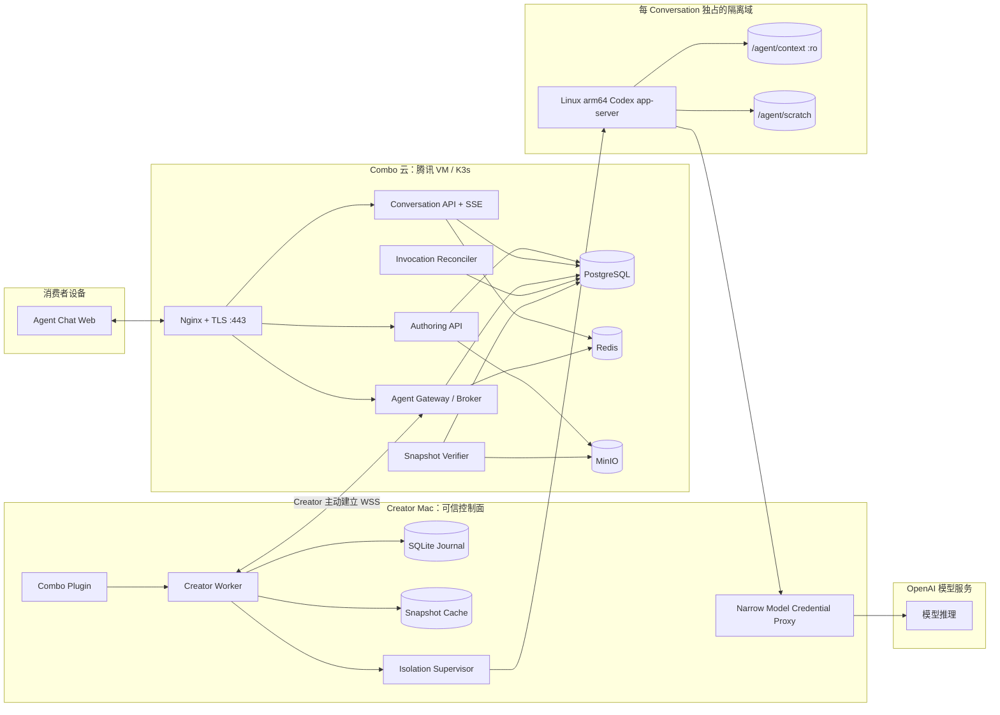
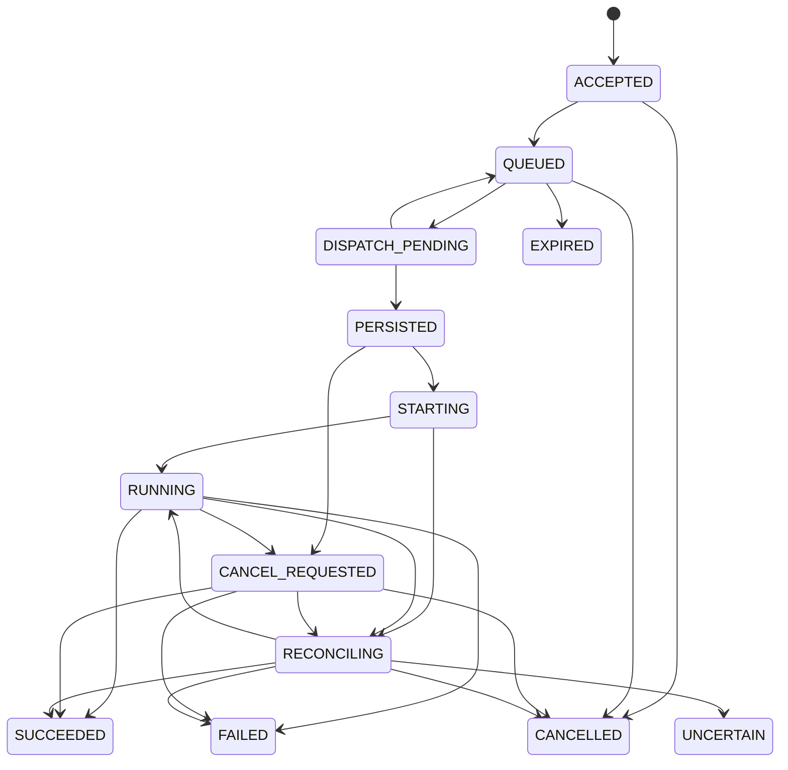
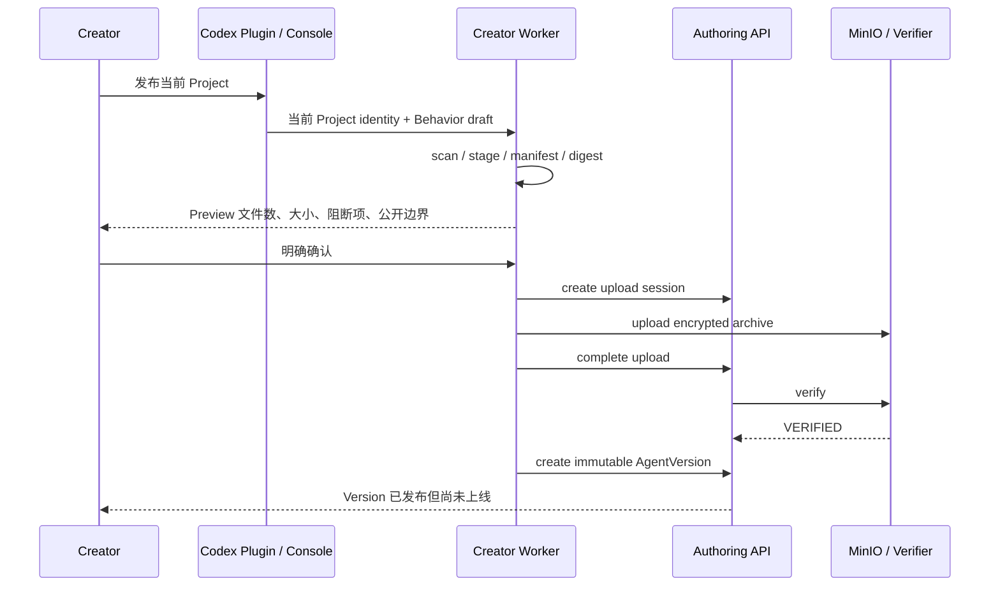
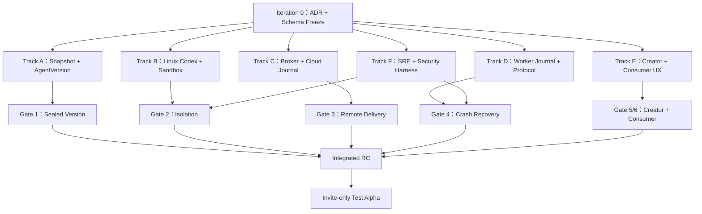

# Combo Creator-hosted Agent VNext 技术方案

> 状态：Proposed Architecture（待评审）  
> 日期：2026-08-13  
> 目标版本：邀请制 Test Alpha  
> 方案对象：Combo Plugin、Creator Worker、Codex Host Adapter、Combo 云控制面、消费者聊天产品

---

## 0. 执行摘要

### 0.1 一句话定义

Combo VNext 是一个 **Creator-hosted Agent 平台**：创作者把一个经过筛选、冻结、可校验的 Project Context 发布成不可变 `AgentVersion`；消费者通过 Combo 云聊天；消息由 Combo Broker 转发到创作者 Mac；创作者本机的 Creator Worker 在每个 Conversation 独占的隔离环境中运行 Codex；真正的模型推理由 OpenAI 模型服务完成。

### 0.2 五个真实运行位置

| 位置 | 主要职责 | 明确不负责 |
| --- | --- | --- |
| 消费者浏览器 | 多轮文字聊天、停止、重试、状态展示 | 不运行 Codex，不接触 Project |
| Combo 云 | 身份、AgentVersion、Snapshot、Broker、Journal、聊天记录 | 不运行 Creator 的 Codex Runtime |
| Creator Mac | Creator Worker、凭据代理、Snapshot 缓存、隔离环境管理 | 不开放公网入站端口 |
| Conversation Sandbox | Codex app-server、只读 Context、会话独占 scratch | 不接触 Creator HOME、其他 Project、长期凭据 |
| OpenAI 模型服务 | 模型推理 | 不管理 Agent 发布、路由和在线状态 |

### 0.3 本方案冻结的核心决策

1. **Combo 云保存不可变 Project Snapshot。** Codex 是读取和使用 Context 的运行时，不是 Context 的长期存储。
2. **Creator Worker 是独立本地守护进程。** 它可以由 Codex Plugin 启动和管理，但不“住在某个 Codex 对话里”。
3. **AgentVersion 不可修改。** Project、行为规则、运行权限、输入输出规则、Codex 版本任一变化都创建新版本。
4. **Conversation 创建时固定 AgentVersion。** Deployment 更新只影响新 Conversation。
5. **每 AgentVersion 共享只读基础镜像；每 Conversation 独占运行安全域。** VM 只在活跃期存在，不是永久常驻。
6. **External Alpha 的首选隔离候选是 Apple `container`；Lima/VZ 是兼容候选。** 两者都必须先通过真实 Spike，失败时不得回退到 Native unisolated Runtime。
7. **Worker 主动连接 Combo 云。** 云端只公开 TLS 443；Creator Mac 不开公网端口。
8. **PostgreSQL 和 Worker SQLite 才是事实源。** Redis、WebSocket、内存 Map 都只是加速或传输层。
9. **不承诺 exactly-once inference。** 采用至少一次投递、端到端幂等、Lease/Fence 和 `UNCERTAIN` 状态。
10. **Alpha 是受邀、文字输入输出、WIP=1。** 不支持匿名公网、文件上传、外部 Action、任意网络和 Project 代码执行。

### 0.4 当前状态与目标状态

当前 Creator Worker RC 已经证明：

- 能启动固定版本 Codex app-server；
- 一段浏览器 Conversation 能映射到一个 Codex thread；
- 多轮、两会话逻辑隔离、WIP=1、messageId 幂等、停止和真实模型调用可以成立；
- Combo 不需要再造模型 Runtime。

但当前 RC 仍然只有本机 loopback 体验，明确没有：

- OS/VM 级文件读取隔离；
- Combo Broker、Worker Lease、Heartbeat；
- 云端不可变 AgentVersion；
- Durable Invocation Journal；
- 公网消费者身份与正式聊天产品；
- 跨进程/断网后的可靠恢复。

因此本方案不是给 RC 增加几个 API，而是把已经验证的 Host Adapter 放入一条完整、可审计的产品链路。

### 0.5 先用一个高中校园比喻建立直觉

把整个产品想成一所允许外校同学在线提问的学校：

| 技术对象 | 校园比喻 | 真正含义 |
| --- | --- | --- |
| `ContextSnapshot` | 盖章封存的一套教材 | 发布时冻结的 Project 文件；之后原 Project 改变也不会偷偷改变旧版本 |
| `BehaviorContract` | 老师的岗位说明书 | Agent 的目标、回答方式、证据规则和“不知道就直说”等语义要求 |
| `RuntimePolicy` | 教室纪律和门禁 | 能看到哪些文件、能否联网、能否写入、最长回答多久；必须由系统强制，不靠口头提醒 |
| `AgentVersion` | 教材、岗位说明和纪律的同一版课程包 | 一次发布的不可变 Agent 身份；任何关键内容变化都产生新版本 |
| `Creator Worker` | 创作者电脑上的值班老师 | 接收云端问题、核对版本、准备隔离环境、调用 Codex、记录结果并报告在线状态 |
| Conversation Sandbox | 每位消费者独立的考试教室 | 只能看到本版本教材和自己的草稿纸，不能看到 Creator HOME 或其他消费者内容 |
| Codex Runtime | 会查教材、维护上下文并组织作答的教师工作台 | 管理 thread、读取 Context、编排工具和模型请求；它不是模型权重本身 |
| OpenAI 模型服务 | 真正完成语言计算的大脑 | 根据 Codex 提供的必要信息产生回答 |
| Combo Broker | 校内收发室 | 把消费者问题送到正确的 Creator Worker，再把结果送回来 |
| Durable Journal | 两边都签字的收发登记簿 | 机器断电或网络中断后，仍能知道消息到底收到、开始、完成还是无法确认 |

这张表揭示了方案的主线：**云端负责保存和送达，本机负责安全运行，Codex 负责组织推理，模型负责计算；任何一层都不能冒充另一层。**

---

## 1. 产品定义、范围与成功条件

### 1.1 产品定义

消费者得到的是：

> 一个由创作者发布的固定 Project Context 和行为规则驱动、由创作者自己的 Codex Runtime 执行、可通过 Combo 网页进行多轮文字聊天的在线 Agent。

这不是：

- GitHub Repo 分享器；
- 一次性 Prompt 模板；
- Combo 自建的云端 Agent Runtime；
- “私有 Context 永远不会被回答出来”的保密计算；
- 24×7 托管服务。

### 1.2 Alpha 用户承诺

Creator 可以：

1. 选择当前 Codex Project；
2. 预览将被发布的文件数量、大小、阻断项和行为说明；
3. 发布不可变 AgentVersion；
4. 上线、查看实际状态、Drain、紧急下线；
5. 创建新版本并切换；
6. 查看不含敏感正文的运行诊断。

Consumer 可以：

1. 通过受邀链接打开 Agent；
2. 创建独立 Conversation；
3. 多轮发送文字并收到文字回答；
4. 看见在线、忙碌、离线、排队、失败和不确定状态；
5. 停止当前回答；
6. 在安全条件成立时重试；
7. 刷新页面后恢复可见消息和最终状态。

### 1.3 Alpha 明确非目标

- 匿名无限公开聊天；
- Marketplace；
- 文件/图片/语音输入；
- 外部写操作、支付、邮件、浏览器或第三方工具；
- 执行 Project 中的代码、安装依赖或运行服务；
- 一个 Creator 高并发；
- 多节点、高可用、多 Region；
- Combo 对 Context 和聊天正文的零知识加密；
- 任意 Codex 版本自动兼容；
- Project Agent V0 兼容；
- 精细计费和生产 SLA。

### 1.4 Test Alpha 成功条件

进入受邀 Alpha 前必须同时满足：

- 1–3 位 Creator、5–20 位受邀 Consumer 可以完成真实远程多轮；
- 同一 Project 发布后修改活目录，不改变已发布版本；
- 任意 Snapshot 篡改都会被拒绝；
- 两个 Conversation 不能读取彼此状态；
- 恶意 Prompt 不能读取 Creator HOME、其他 Project、Keychain、auth 或通用 `/tmp`；
- 同一消息重复 100 次最多形成一个自动 Codex dispatch；
- Worker、Broker、Host 在每个关键故障窗口崩溃后，Invocation 都落到可解释状态；
- Snapshot、PostgreSQL 有异机备份且完成一次真实恢复；
- Creator Worker 在线时完整回答成功率达到 95% 以上；
- 跨 Creator/Conversation 泄漏、重复 final、未授权访问为 0。

---

## 2. 架构原则

### 2.1 Context、Runtime 和 Model 必须分开

```text
ContextSnapshot：Agent 知道什么
BehaviorContract：Agent 应怎样回答
RuntimePolicy：Agent 被允许做什么
IOContract：消费者怎样输入和接收输出
Codex Runtime：怎样读取、编排、维护 thread
Model Service：怎样计算下一段输出
```

Project 不是 Agent，Codex 也不是模型本身。正式 `AgentVersion` 必须把上述边界显式表达出来。

### 2.2 安全不能依赖 Prompt

“不要读取 Creator HOME”只是一句话，不是权限边界。即使消费者输入完全恶意，操作系统仍必须保证 Sandbox 看不到 Creator HOME、其他 Project 和长期凭据。

### 2.3 控制面与语义输入分离

Broker Envelope 内的 `agentVersionId`、`conversationId`、`invocationId`、Lease、Fence、Signed URL 和凭据只用于控制、对账和授权，不拼接进模型 Prompt。

模型语义输入只能包含：

- BehaviorContract；
- 当前 Conversation 的可见历史；
- 当前用户文字；
- Codex 按需从只读 Snapshot 读取的内容。

### 2.4 不确定就停止

Snapshot digest、Worker Lease、Sandbox Attestation、Codex 版本、Journal 写入任何一个无法验证时，都不能开始推理。已经越过 Codex dispatch 边界但无法确认终态时，进入 `UNCERTAIN`，不自动重跑。

### 2.5 存储与计算分离

- Combo MinIO 保存发布后的不可变 Context；
- Creator Mac 保存运行缓存和本地 Journal；
- Conversation Sandbox 承担 Codex Runtime；
- OpenAI 服务完成模型计算。

这不等于“数据不离端”：被 Codex 选择用于回答的 Context 仍会进入模型请求。

---

## 3. 按实体环境划分的总体架构



### 3.1 发布路径

```text
Creator 活 Project
→ 本地扫描与 Preview
→ 确定性 Snapshot staging
→ manifest/archive digest
→ MinIO 临时上传
→ 云端重新校验
→ 创建不可变 AgentVersion
→ Creator 明确选择上线
```

### 3.2 聊天路径

```text
Consumer message
→ Conversation API 在 PostgreSQL 落 USER message + Invocation + Outbox
→ Broker 投递给持有有效 Lease 的 Worker
→ Worker 在 SQLite 持久化 prepare
→ 创建或恢复 Conversation Sandbox
→ 校验 AgentVersion 与 Snapshot
→ Codex turn/start
→ OpenAI 模型推理
→ Worker 本地持久化 final
→ 云端事务提交 ASSISTANT message + terminal Event
→ SSE 返回消费者
```

### 3.3 公网边界

云端只公开 TLS 443：

```text
/a/{slug}                         消费者页面
/v1/creator/...                   Creator API
/v1/conversations/...             Conversation API
/v1/conversations/{id}/events     SSE
/v1/worker/connect                Worker WSS
```

不公开 PostgreSQL、Redis、MinIO Console、K3s API、NodePort、Creator Worker 或 Sandbox。

---

## 4. 核心领域对象

| 对象 | 定义 | 可变性 | 权威位置 |
| --- | --- | --- | --- |
| `Agent` | 消费者看到的稳定产品身份 | 名称描述可变 | PostgreSQL |
| `ContextSnapshot` | 经过筛选和冻结的 Project 文件集合 | 不可变 | MinIO + digest |
| `BehaviorContract` | Agent 岗位说明书 | 随 Version 冻结 | AgentVersion JSON |
| `RuntimePolicy` | 文件、网络、工具、预算和隔离要求 | 随 Version 冻结 | AgentVersion JSON |
| `IOContract` | 输入输出类型和上限 | 随 Version 冻结 | AgentVersion JSON |
| `AgentVersion` | 一组可执行、可校验的固定契约 | 不可变 | PostgreSQL |
| `Deployment` | 当前希望/实际对外服务哪个 Version | 可变 | PostgreSQL |
| `WorkerInstallation` | Creator Mac 上稳定安装身份 | 可撤销 | PostgreSQL + Keychain |
| `WorkerLease` | 某 Worker 在一段时间内管理 Deployment 的权利 | 短期可续 | PostgreSQL |
| `Conversation` | 消费者多轮对话，固定 Version | 消息可增长，Version 不变 | PostgreSQL |
| `Message` | 用户或助手可见消息 | 创建后不改正文 | PostgreSQL |
| `Invocation` | 一条用户消息的一次执行尝试 | 只按状态机前进 | PostgreSQL + SQLite |

### 4.1 AgentVersion 组成

```text
AgentVersion
= ContextSnapshot digest
+ BehaviorContract digest
+ RuntimePolicy digest
+ IOContract digest
+ Codex Runtime artifact digest
+ Codex app-server schema digest
+ ModelPolicy
```

显示名称、发布时间和统计数据不进入 `versionDigest`，因为它们不影响推理语义。

### 4.2 BehaviorContract

MVP 使用简单结构化 JSON，不设计复杂 DSL：

```json
{
  "schemaVersion": 1,
  "role": "BENZEMA 知识库研究助理",
  "objective": "根据已发布资料回答消费者问题",
  "developerInstructions": [
    "优先使用 Context 中的依据",
    "资料不足时明确说明不知道",
    "不得虚构文件、人物、数字或日期"
  ],
  "language": "zh-CN",
  "evidencePolicy": "cite-relative-path-when-used",
  "answerStyle": "conclusion-evidence-risk"
}
```

BehaviorContract 不是权限系统。能否联网、写文件或调用工具属于 RuntimePolicy。

### 4.3 RuntimePolicy

```json
{
  "schemaVersion": 1,
  "isolation": "conversation-vm-required",
  "filesystem": {
    "context": "read-only-noexec",
    "scratch": "conversation-only",
    "hostMounts": "forbidden"
  },
  "network": "model-proxy-only",
  "externalTools": "disabled",
  "hostCredentials": "forbidden",
  "maxTurnSeconds": 120,
  "maxConversationTurns": 20,
  "maxActiveTurns": 1,
  "resolvedModel": "pinned-by-version",
  "reasoningEffort": "pinned-by-version"
}
```

Codex 内部可能仍需要受限 Shell 读取文件，但它只运行在隔离 VM 内，Context mount 为 `noexec`，没有 Host mount 和任意网络；它不是消费者可直接调用的产品工具。

### 4.4 IOContract

```json
{
  "schemaVersion": 1,
  "input": { "type": "text", "maxUtf8Bytes": 16384 },
  "output": { "type": "text", "maxUtf8Bytes": 32768 },
  "files": false,
  "actions": false,
  "rawReasoning": false
}
```

---

## 5. 不可变 ContextSnapshot

### 5.1 解决的问题

确定性 Snapshot 不是为了让模型答案逐字相同，而是保证：

> 相同 Project 文件集合总能产生同一内容身份；任意内容变化都会创建不同身份。

它解决：版本漂移、完整性校验、缓存、回滚、复现、审计和“扫描的文件与真正运行的文件不是同一份”的 TOCTOU 问题。

### 5.2 Alpha 输入边界

Alpha 只接受：

- UTF-8 文本、Markdown、JSON、CSV 和代码文本；
- 普通目录和普通文件；
- 压缩后不超过 50 MiB；
- 解包后不超过 200 MiB；
- 不超过 2,000 个文件；
- 单文件不超过 10 MiB；
- 相对路径 UTF-8 不超过 512 bytes。

拒绝：

- 绝对路径、`..`、NUL、控制字符和 Unicode normalization collision；
- symlink、hardlink、socket、FIFO、设备文件和 Git submodule/gitlink；
- `.git`、`node_modules`、`.env*`、`~/.ssh`、Codex 配置和系统缓存；
- PEM 私钥和高置信度 token；
- 二进制或无法识别的文件；
- 压缩炸弹和异常压缩比。

Secret 扫描只能降低风险，不能证明“没有秘密”。Creator 最终必须明确确认发布内容会进入 Combo 云，并可能被 Agent 回答出来。

### 5.3 确定性打包规范

1. 先把选定内容复制进新的 staging 目录；之后不再读取活 Project。
2. 路径使用 `/`，按 UTF-8 byte order 排序。
3. 拒绝 Unicode 规范化后冲突的两个路径。
4. 固定 tar 内 uid/gid、owner/group、mtime。
5. 目录 mode 固定；文件只保留必要的可读属性，运行挂载统一只读/noexec。
6. 每个文件记录路径、size、media type 和 SHA-256。
7. Manifest 使用 RFC 8785 JCS canonical JSON。
8. 使用固定 tar 和 zstd 参数生成 archive。
9. 对 Manifest、archive 明文字节、加密对象分别计算摘要。

```text
snapshotDigest = SHA256(JCS(snapshot-manifest.json))
archiveDigest  = SHA256(snapshot.tar.zst)
archiveCipherDigest  = SHA256(snapshot.tar.zst.enc)
manifestCipherDigest = SHA256(snapshot-manifest.json.enc)
```

### 5.4 MinIO 对象布局

不做跨 Creator 去重，避免通过摘要或时延推测其他 Creator 是否拥有相同内容：

```text
Bucket: combo-agent-versions-test

creators/{creatorId}/snapshots/sha256/{prefix}/{snapshotDigest}.tar.zst.enc
creators/{creatorId}/manifests/sha256/{prefix}/{snapshotDigest}.json.enc
creators/{creatorId}/publications/sha256/{prefix}/{snapshotDigest}.prepare.json
creators/{creatorId}/publications/sha256/{prefix}/{snapshotDigest}.commit.json
uploads/{creatorId}/{uploadId}/archive.part
uploads/{creatorId}/{uploadId}/manifest.part
```

这是对象存储 key，不是 Creator Mac 文件路径，也不是消费者可访问的公开 URL。

`prepare.json` 是 Verifier/Recovery/Backup 专用的私有恢复控制面：它只在两个 temp 密文完成 whole-object、双 AEAD、canonical Manifest、archive 和逐文件验证后，以 `If-None-Match: *` 冻结首个已验证的完整双 Envelope、checksum、计数和 `selectedUploadId`。其中 `wrappedDek` 是 RFC3394 包裹后的 key ciphertext，不是明文 DEK；Data-flow Allowlist 明确允许它只存在于私有 marker body，禁止复制到 S3 user metadata、URL、日志、浏览器、Gateway 或模型输入，普通 reader 没有 unwrap authority。

`commit.json` 只保存 Creator/Snapshot、固定 preparation key 和 exact canonical preparation digest。它在两个正式密文完整读回并再次验证后才条件创建，是唯一的读可见性权威；只有 final、只有 preparation、或 preparation 加两个 final 但没有 commit 都属于不可见的恢复中状态。hash link 能检测普通损坏和单对象错配，但不替代正式 IAM、Object Lock、外部签名或异机恢复证据。

### 5.5 上传与校验

```text
Worker 先用同一 Snapshot DEK、不同 nonce 加密 archive 与 canonical manifest
→ Worker 用两个完整 Envelope/cipherBytes/cipherDigest/base64 checksum 请求 upload session
→ 云端返回分别绑定 exact temp key/size/checksum/If-None-Match/metadata 的两条短期 PUT
→ Worker 按返回的完整 requiredHeaders 上传两个密文对象
→ complete 只触发 VERIFYING
→ Snapshot Verifier 完整读取并 AEAD 认证两个 temp 对象，重算 manifest/archive/snapshot digest
→ 认证与内容验证全部成功后才 conditional create preparation marker，冻结首个密文对
→ conditional materialize 两个正式 key，并完整读回、认证和复核
→ conditional create commit marker；只有该原子 marker 成功并可读后才是 VERIFIED
→ VERIFIED 或 REJECTED
→ 只有 VERIFIED Snapshot 能创建 AgentVersion
```

Verifier 在 archive final 成功、manifest final 或 commit 失败后重放同一 preparation：原 temp 仍在时直接补齐；原 temp 丢失时，新 upload 必须先用自己的 Envelope 完成双 AEAD、canonical manifest/archive/逐文件和全部明文身份验证。只有 `creatorId + snapshotDigest + archiveDigest + 双明文长度 + fileCount + expandedBytes` 全部一致，才允许 unwrap prepared DEK，并使用 prepared nonce 与 exact prepared AAD 重建同一密文；重建结果的 nonce/tag/cipherDigest/cipherBytes/checksum 任一不等即在 PUT 前拒绝。这里是同一 `(key, nonce, AAD, plaintext)` 的 exact replay，不授权一般调用方注入 nonce，也不允许对不同明文或 AAD 复用 GCM nonce。

若异机恢复或对象丢失形成 `commit + preparation + 单/零 final`，普通 Reader 仍按 commit authority fail-closed，不能返回残缺 pair；Recovery 则先独立核验 commit 与 preparation 的 hash link，再按上述完整验证规则用原 temp 或新 upload 补齐缺失 final。已存在但损坏/越权覆盖的 final 无法用 `If-None-Match` 安全替换，必须保持 BLOCKED 并进入受审的对象恢复流程，adapter 不以特权 delete 绕过不可变性。

正式对象不可覆盖。删除只能由带审计的 Retention/Reclaimer 身份完成。

### 5.6 加密与隐私

Alpha 采用 Combo 管理的 envelope encryption：每个 Snapshot 一个随机 DEK，AES-256-GCM 加密；DEK 由 KEK 包裹。KEK 初期放 K8s Secret，并必须有独立加密恢复材料；中期迁移腾讯 KMS。

这能防止普通磁盘、对象和备份泄露，但 **不能防止 Combo 特权运维读取内容**。如果未来承诺 Combo 看不到 Context，必须另做 Creator-held key、设备迁移和恢复协议，不能把当前方案描述成端到端加密。

---

## 6. Combo Plugin 与 Creator Worker

### 6.1 Plugin MVP 只保留一个业务 Skill

```text
combo-live-agent
```

它只负责识别和解释三类 Creator 意图：

- 发布或更新当前 Project Agent；
- 查看状态或打开 Creator Console；
- 上线、Drain 或紧急下线。

OAuth、安装诊断和错误分支保持在这一个 Skill 的短章节中；不再提供独立 `basics`、`verification`、`known-errors` 或 V0 Skill。真正的校验下沉到代码、Schema、Worker 和发布 Gate，不能由 Skill 自证。

### 6.2 敏感操作进入本地 Creator Console

Plugin 不把整个文件清单、Signed URL 或凭据交给模型。它只启动签名的 Creator Worker/Console，并传入由 Codex Host 提供、由 Creator 再确认的当前 Project identity。

Creator Console 提供：

- Preview；
- Publish；
- Go Online；
- Drain；
- Emergency Offline；
- Status；
- Update；
- Rollback。

本地控制接口优先使用权限为 `0600` 的 Unix domain socket，不使用公网端口。开发 RC 的 loopback HTTP 页面保留为开发模式，不作为正式控制边界。

### 6.3 Creator Worker 模块

```text
Creator Worker
├── Local Control API
├── Snapshot Builder / Cache
├── Combo OAuth + Device Identity
├── Broker WSS Client
├── SQLite Journal + Outbox
├── Deployment Reconciler
├── Isolation Supervisor
├── Codex Host Adapter
└── Narrow Model Credential Proxy
```

当前 `apps/creator-worker` 的 Host Adapter、WIP=1、messageId 幂等、取消和 loopback 测试可以复用；内存 Conversation/Invocation Map 必须替换为 SQLite Journal。

### 6.4 Creator Worker 身份

1. Creator 通过浏览器完成 Combo OAuth；
2. Worker 在 Secure Enclave 生成不可导出的 P-256 ECDSA device key；
3. 云端登记 public key；
4. Worker 用 OAuth 换取短期 challenge；
5. Worker 签名 nonce，获得短期 Worker Session；
6. Worker 主动建立 `wss://.../v1/worker/connect`；
7. Session 绑定 `creatorId + installationId + publicKey + workerVersion`。

Combo OAuth、Device private key 和模型凭据都不能进入 Snapshot、SQLite 明文、普通日志或 Sandbox。

### 6.5 Worker 生命周期

```text
STOPPED
→ AUTHENTICATING
→ CONNECTING
→ RECONCILING
→ READY
→ DRAINING
→ STOPPED

任何安全或兼容失败：BLOCKED
```

Worker 只有在本地 Journal 对账完成、Snapshot/Runtime capability 可用之后，才能报告 READY。

---

## 7. Conversation Sandbox 与 Codex Runtime

### 7.1 隔离单元

采用：

> 每个 AgentVersion 共享不可变 Context image；每个 Conversation 独占 Sandbox、Codex thread 和可写状态；实例只在活跃期存在。

不采用每 Agent 共享 VM，因为同一 Agent 的不同消费者仍会共享进程、scratch 和潜在残留。也不采用每 Turn 新 VM，因为会破坏多轮、增加冷启动和恢复复杂度。

### 7.2 Sandbox 只允许看到

```text
/agent/context    当前 AgentVersion，read-only/noexec
/agent/scratch    当前 Conversation 独占，有限额
/tmp              当前 Conversation 独占，有限额
/usr/local/bin    固定 Codex 与受审系统工具，只读
```

绝不挂载：

- `/Users`、`/Volumes`、`/private`；
- Creator 活 Project；
- Creator HOME、`.ssh`、Keychain、`.codex`；
- Docker/Kubernetes Socket；
- 其他 Conversation state；
- 长期 OpenAI 或 Combo 凭据。

### 7.3 资源默认值

以下为 Spike 初始上限，真实测量后只允许收紧或通过新 RuntimePolicy 发布：

| 资源 | Alpha 初始值 |
| --- | ---: |
| vCPU | 2 |
| RAM | 2 GiB |
| scratch | 256 MiB |
| PID | 256 |
| file descriptors | 256 |
| 单 Turn deadline | 120 秒 |
| 空闲 Sandbox TTL | 10 分钟 |
| 单次输入 | 16 KiB UTF-8 |
| 单次输出 | 32 KiB UTF-8 |
| 每 Conversation 可见历史 | 20 轮 / 64 KiB |

当前 Creator Mac 为 16 GiB，Alpha 强制每个 Creator 全局 `WIP=1`。

### 7.4 多轮与 Sandbox 回收

- Sandbox 存活期间复用同一 Codex thread；
- 空闲 TTL 到期后销毁 VM 和 scratch；
- 云端保存消费者可见 transcript，不保存隐藏 reasoning；
- 下一次消息使用 BehaviorContract + 可见 transcript 重建新 thread；
- 重建不承诺与原 thread 内部状态逐字等价；
- Linux app-server 是否支持更可靠的 conversation-specific state volume/resume，作为 Spike 验证项，未验证前不能成为强依赖。

### 7.5 Sandbox Attestation

开始推理前 Worker 必须得到并写入 Journal：

```ts
type SandboxAttestation = {
  schemaVersion: 1;
  adapter: "apple-container" | "lima-vz";
  sandboxInstanceId: string;
  conversationId: string;
  invocationId: string;
  workerSessionId: string;
  leaseId: string;
  fencingToken: string; // canonical uint63 decimal, 0..9223372036854775807
  bootNonce: string;
  codexImageDigest: string;
  codexVersion: string;
  protocolSchemaDigest: string;
  agentVersionDigest: string;
  snapshotDigest: string;
  behaviorDigest: string;
  runtimePolicyDigest: string;
  ioContractDigest: string;
  noHostHomeMount: true;
  contextReadOnly: true;
  contextNoExec: true;
  noLongLivedCredential: true;
  egressMode: "model-proxy-only";
  proxyTransportBinding: string;
  createdAt: string;
  expiresAt: string;
  destroyed: false;
  signatureAlgorithm: "P-256-ECDSA-SHA256";
  supervisorSignature: string;
};
```

Supervisor 对 canonical Attestation bytes 使用本 installation 的 Device key 签名；Worker、Model Proxy 和云端使用已登记 public key 验证。Worker 维护 active-instance registry，销毁时原子 revoke `sandboxInstanceId + bootNonce`；旧 Attestation、跨 Conversation/Version/Worker 重放或过期一律 fail closed。Model Proxy 只接受来自 `proxyTransportBinding` 指定的受保护通道，并生成绑定同一 Invocation 的 request receipt。

这是官方 Worker 的软件证明，不是恶意 Creator 无法伪造的硬件远程证明；产品文案不得扩大其含义。

### 7.6 隔离技术选择

| 方案 | 用途 | 决策 |
| --- | --- | --- |
| Apple `container` | 每个 Linux Container 一个轻量 VM | External Alpha 首选候选，先 Spike |
| Lima + VZ | Linux Codex 兼容性和独立 VM 备选 | 兼容候选，必须关闭默认 mounts/forwarding |
| Colima / Docker | 快速证明 Linux Codex 可运行 | 仅 trusted internal prototype |
| Virtualization.framework | 自研 VMM | Apple Container 失败且确有必要时再投资 |
| Native macOS | 当前 RC/本地开发 | 外部消费者路径禁止 |
| Cloud K3s Sandbox | 云托管 Runtime | 本版本不采用，无法保护 Creator Mac |

Apple `container` 官方在 Apple Silicon/macOS 26 上以独立轻量 VM 运行每个 Linux Container，并兼容 OCI；但项目仍在 1.0 前，必须 pin 精确版本。Lima 在现代 macOS 可使用 VZ，但默认开发便利配置不构成安全边界。

### 7.7 Linux arm64 Codex Spike

OpenAI 官方提供 Linux arm64 Codex。真正要验证的是固定版本是否满足：

1. app-server exact schema；
2. initialize/thread/start/turn/start；
3. 三轮多轮；
4. streaming 和 interrupt；
5. Context 读取；
6. 模型 Credential Proxy；
7. 冷启动、首 token、RAM；
8. Project 无执行、网络和 Host 访问；
9. 升级时 conformance suite。

Spike A 先用 Lima/Colima证明“跑得起来”；Spike B 用 Apple Container证明“隔得开”。

### 7.8 Context 读取闭世界

External Alpha 固定选择 Guest 内置的 `read_context/list_context/search_context` 三个受控能力；Codex Runtime 不提供通用 shell、解释器、编译器、动态 loader 或任意 `exec`。三工具只对启动时打开的 `/agent/context` root fd 工作，拒绝 absolute path、`..`、symlink/hardlink escape、跨 Version/Conversation capability、未知字段和超限输出；返回纯文本/结构化结果，不执行 Project bytes。

Host Context Tool Broker 暂不进入本版本。若未来改用它，必须新增独立协议、root-fd confinement、capability、输出/正则预算和 Host canary 安全评审，不能沿用本版本 Gate 自动放行。

### 7.9 Narrow Model Credential Proxy

Sandbox 中不能存在 Creator 的长期 `auth.json` 或 API key。目标结构：

```text
Sandbox Codex
→ 会话级、限时、限模型、限预算 capability
→ Host Model Proxy（可信）
→ Creator 的真实 OpenAI/Codex 凭据
→ OpenAI
```

Capability 绑定 Conversation、AgentVersion、模型、预算和截止时间，Sandbox 销毁即失效；不能刷新、不能访问 Combo API、不能作为通用 HTTP CONNECT。

这是 External Alpha 的技术硬门：如果固定版本 Codex 无法通过受限代理调用模型，而只能把 Creator 长期凭据复制进 VM，则 External Alpha 不上线。

---

## 8. Combo 云组件与代码落点

### 8.1 云端组件

| 组件 | 代码建议 | 责任 |
| --- | --- | --- |
| Authoring API | 扩展 `apps/authoring` | Agent、Snapshot upload/finalize、AgentVersion、Deployment、Creator 权限 |
| Conversation API | 扩展 `apps/runtime` | Conversation、Message、Invocation、SSE、Consumer 权限 |
| Agent Gateway | 新增 `apps/agent-gateway` | Worker WSS、Heartbeat、Lease、Outbox 投递、Delta fan-out |
| Invocation Reconciler | Gateway 独立进程模式或新 module | Lease 超时、UNCERTAIN 对账、stuck cleanup |
| Snapshot Verifier | Authoring Job/Worker | 解密、限制性解包、digest/secret/size 校验 |
| Creator Worker | 继续演进 `apps/creator-worker` | 本地守护进程、Host Adapter、Journal、Sandbox、Proxy |
| Shared Protocol | 扩展 `packages/shared` 或新 `packages/creator-agent-protocol` | Zod/JSON Schema、状态机、digest、错误码 |
| Creator Web | 扩展 `apps/web` | Creator Console 云端视图 |
| Consumer Chat | 精简 `apps/runtime-web` | 正式 AgentChatPage，不复用整个 artifact-centric ChatPage |

### 8.2 现有能力的复用原则

可复用：

- 现有 `sessions/messages/turns` 的 HTTP/SSE 经验；
- `Last-Event-ID` 续传和最终消息落库模式；
- Creator Worker 的 app-server client、WIP=1、幂等和取消测试；
- 当前 Test 的 PostgreSQL、Redis、MinIO、Nginx 和环境晋级机制；
- 镜像 digest、release manifest 和部署 SHA 校验。

不能直接复用为正式事实：

- 当前 API 进程内直接推理的 runner；
- Worker 内存 Map；
- loopback capability 作为公网身份；
- fake Host 测试作为真实隔离证据；
- optional、未部署的 cloud sandbox overlay；
- Preview/Prod 共享 foundation 作为 Test Alpha 隔离证明。

### 8.3 Namespace 决策

Test Alpha 先遵循现有权威部署拓扑，部署在 `combo-test`，复用 Test foundation。因为 ResourceQuota 会覆盖整个 Namespace，落地前必须先盘点并 right-size 所有既有 Pod，再增加 namespace-wide Quota/LimitRange；不能直接套一个新额度导致现有 rollout 失败。

如果后续要使用独立 `combo-agent-test`，必须先修改权威 `docs/deployment-topology.md`、render/deploy workflow 和跨 Namespace RBAC，不能形成部署体系之外的手工孤岛。

---

## 9. PostgreSQL 数据模型

### 9.1 通用规范

- 服务端 ID：UUIDv7，作为 opaque ID；
- 时间：UTC `timestamptz`，云端时间决定 Lease；
- 公开artifact/Snapshot内容寻址摘要：SHA-256小写十六进制；
- Prompt/Answer等敏感内容的`request/content/result digest`：domain-separated HMAC-SHA-256，使用按tenant/version轮换的KMS/Keychain key；不得存裸plaintext SHA-256，密文完整性另用cipher digest/AEAD tag；
- JSON 摘要：RFC 8785 JCS；
- 所有可重试写 API：`Idempotency-Key + requestDigest`；
- 每张租户表包含 Creator/Consumer owner，使用复合约束或 RLS 防跨租户；
- Redis 和 WSS 不保存权威终态；
- Event append 与 Projection update 必须在同一 PostgreSQL transaction。

### 9.2 `snapshot_uploads`

| 字段 | 说明 |
| --- | --- |
| `id` | Upload ID |
| `creator_id` | 所有者 |
| `idempotency_key` / `request_digest` | 幂等绑定 |
| `expected_snapshot_digest` | Manifest digest |
| `expected_archive_digest` | tar.zst digest |
| `expected_archive_cipher_digest/bytes` | archive 密文摘要和长度 |
| `expected_manifest_cipher_digest/bytes` | manifest 密文摘要和长度 |
| `archive_envelope/manifest_envelope` | 完整严格 Envelope；受保护字段，不能复制到日志或普通 metadata |
| `archive_temp_object_key/manifest_temp_object_key` | 两个 Creator-bound 临时 MinIO key，分别 unique |
| `state` | `CREATED/UPLOADED/VERIFYING/VERIFIED/REJECTED/EXPIRED` |
| `error_code` | 稳定错误码 |
| `expires_at/created_at/verified_at` | 时间 |

唯一约束：`(creator_id, idempotency_key)`。同 key 不同 request digest 返回 `409 IDEMPOTENCY_CONFLICT`。

### 9.3 `context_snapshots`

| 字段 | 说明 |
| --- | --- |
| `id` | Snapshot ID |
| `creator_id` | 所有者 |
| `snapshot_digest` | Canonical manifest digest |
| `archive_digest` / `archive_cipher_digest` / `manifest_cipher_digest` | 明文包与两个正式密文摘要 |
| `object_key` / `manifest_object_key` | MinIO 私有对象 |
| `publication_preparation_key/digest` | 已验证密文选择及 canonical marker digest |
| `publication_commit_key/digest` | 唯一读可见性 marker 及 exact body digest |
| `compressed_bytes/expanded_bytes/file_count` | 边界数据 |
| `encryption_key_ref` | wrapped DEK reference |
| `created_at` | 创建时间 |

唯一约束：`(creator_id, snapshot_digest)`。Snapshot 行和对象创建后不可原地覆盖。

当前 `@cb/creator-agent-snapshot` 只实现上述严格 MinIO publication marker 协议和 S3-compatible adapter，没有实现 PostgreSQL repository、migration 或跨 PG/MinIO transaction。后续 PG adapter 必须原样持久化双 Envelope、双 temp/final key 与两个 marker digest，并以 commit marker 已核验作为 `VERIFIED` 前置条件；当前 fake/MinIO 测试不能冒充该 E2 PG 事务证据。

### 9.4 `agents`

```text
id
creator_id
public_slug unique
name
description
lifecycle ACTIVE | ARCHIVED
created_at
updated_at
```

### 9.5 `agent_versions`

```text
id
agent_id
creator_id
ordinal
schema_version
version_digest
snapshot_id
behavior_contract jsonb
behavior_contract_digest
runtime_policy jsonb
runtime_policy_digest
io_contract jsonb
io_contract_digest
model_policy jsonb
codex_runtime_version
codex_runtime_artifact_digest
codex_protocol_schema_digest
created_at
```

约束：

```sql
UNIQUE (agent_id, ordinal)
UNIQUE (agent_id, version_digest)
```

影响执行的列用权限和 Trigger 禁止 `UPDATE`。弃用或撤销写入单独的 `agent_version_controls`：

```text
version_id PK
availability ACTIVE | DEPRECATED | REVOKED
severity NORMAL | SECURITY
reason_code
updated_at
```

### 9.6 `deployments`

```text
id
agent_id
environment TEST | PREVIEW | PROD
desired_state ONLINE | OFFLINE
desired_version_id
serving_version_id nullable
observed_state OFFLINE | PREPARING | ONLINE | UPDATING | DRAINING | DEGRADED | BLOCKED
generation bigint
lease_fence bigint
observed_worker_id nullable
observed_generation
last_error_code nullable
updated_at
```

`UNIQUE(agent_id, environment)`。

`desired_*` 是 Creator 意图；`observed_*` 是真实系统状态。只有 Worker 完成 Snapshot、Codex、Sandbox Smoke 并报告正确 generation/digest 后，云端才在一个事务中切换 `serving_version_id`。

### 9.7 `worker_installations` 与 `worker_leases`

`worker_installations`：

```text
id
creator_id
installation_key_id unique
device_public_key
worker_version
protocol_versions
capabilities
last_seen_at
revoked_at
```

`worker_leases`：

```text
id
deployment_id
worker_id
connection_id
fence bigint
state ACTIVE | EXPIRED | RELEASED | REVOKED
acquired_at
renewed_at
expires_at
```

每个 Deployment 最多一个 Active Lease。Alpha：TTL 30 秒，每 10 秒续租；停止续租后立即停止新 dispatch，Lease 过期不等于在途 Invocation 自动失败。

### 9.8 `agent_conversations`

```text
id
agent_id
deployment_id
agent_version_id immutable
version_digest
consumer_subject_id
state OPENING | IDLE | BUSY | SUSPENDED | CLOSING | CLOSED | FAILED | EXPIRED
assigned_worker_id nullable
next_turn_no
created_at
last_activity_at
expires_at
closed_at
```

Deployment 升级后，旧 Conversation 继续固定旧 Version；新 Conversation 使用新的 serving Version。

### 9.9 `agent_messages`

```text
id
conversation_id
turn_no
role USER | ASSISTANT
client_message_id nullable
content_ciphertext
content_digest
invocation_id nullable
created_at
```

约束：

```sql
UNIQUE (conversation_id, turn_no, role)
UNIQUE (conversation_id, client_message_id)
UNIQUE (invocation_id, role)
```

不保存 chain-of-thought、原始 app-server stream 或 Credential。

### 9.10 `agent_invocations`

```text
id
conversation_id
agent_version_id
user_message_id
client_message_id
request_digest
state
assigned_worker_id
assignment_lease_id
assignment_fence
execution_capability_id
deadline_at
cancel_requested_at
runtime_thread_id nullable
runtime_turn_id nullable
result_message_id nullable
result_digest nullable
error_code nullable
uncertainty_reason nullable
retry_of_invocation_id nullable
created_at
started_at
terminal_at
```

约束：

```sql
UNIQUE (conversation_id, client_message_id)
UNIQUE (user_message_id)
```

并建立部分唯一索引，保证一个 Conversation 只有一个非终态 Invocation。

### 9.11 `agent_invocation_events`

Append-only 事实日志：

```text
id bigint identity
invocation_id
journal_seq
source API | BROKER | WORKER | RUNTIME | RECONCILER
source_event_id
event_type
payload jsonb（严格白名单）
occurred_at
recorded_at
```

约束：

```sql
UNIQUE (invocation_id, journal_seq)
UNIQUE (source, source_event_id)
```

### 9.12 `broker_outbox`

```text
command_id PK
target_worker_id
invocation_id nullable
command_type
dedupe_key unique
state PENDING | SENT | ACKED | EXPIRED
attempt_count
next_attempt_at
created_at
acked_at
```

Consumer API 接收消息时，在一个事务内：

```text
插入 USER message
+ 插入 Invocation
+ 追加 invocation.accepted Event
+ 插入 broker_outbox
+ Conversation 改 BUSY
```

事务提交后才返回 HTTP 202。

---

## 10. Worker SQLite Durable Journal

### 10.1 存储与保护

```text
~/Library/Application Support/Combo Creator Worker/journal-v1.sqlite
```

- 目录 `0700`、文件 `0600`；
- WAL；
- `PRAGMA synchronous=FULL`；
- 单写者；
- Keychain 中的本地密钥对敏感字段 AES-GCM 加密；
- 不把 Prompt、答案、Token、Signed URL 或路径写进普通日志。

### 10.2 核心表

`local_conversations`：

```text
conversation_id PK
agent_version_id
version_digest
snapshot_digest
sandbox_id
runtime_thread_id
state
created_at
updated_at
```

`local_invocations`：

```text
invocation_id PK
conversation_id
client_message_id
request_digest
agent_version_id
lease_id
fence
prepare_command_id unique
start_command_id unique
state
runtime_turn_id
result_ciphertext
result_digest
error_code
created_at
updated_at
```

另有 append-only `local_events` 和等待云端 durable ACK 的 `local_outbox`。

### 10.3 重复输入规则

- `invocationId + requestDigest` 相同：返回已知状态或同一结果；
- `invocationId` 相同但 digest 不同：拒绝并触发安全告警；
- `conversationId + clientMessageId` 相同但 Invocation 不同：拒绝，避免云端 bug 产生第二个 Codex Turn；
- 只有 SQLite commit 成功后才能发送 `invocation.prepared`；
- final 必须先写本地 result + outbox transaction，再发给云端。

---

## 11. Broker 协议

### 11.1 Worker 握手

Worker 主动连接：

```text
WSS /v1/worker/connect
```

```json
{
  "protocol": "combo.creator-broker/1",
  "installationId": "uuid",
  "workerVersion": "x.y.z",
  "supportedProtocolVersions": [1],
  "codexRuntimeArtifacts": ["sha256:..."],
  "isolationModes": ["apple-container-v1"],
  "capacity": {
    "maxActiveConversations": 1,
    "maxActiveTurns": 1
  }
}
```

云端验证 Device signature、Worker allowlist、协议、隔离能力和 Codex artifact 后才授予 Lease。

### 11.2 通用 Envelope

```json
{
  "protocol": "combo.creator-broker/1",
  "schemaVersion": 1,
  "kind": "command",
  "messageId": "uuidv7",
  "type": "invocation.prepare",
  "correlationId": "invocation-id",
  "connectionId": "uuid",
  "sequence": 187,
  "sentAt": "2026-08-13T08:00:00Z",
  "expiresAt": "2026-08-13T08:00:30Z",
  "lease": {
    "deploymentId": "uuid",
    "leaseId": "uuid",
    "fence": "42"
  },
  "body": {}
}
```

序列号是每连接单调递增；`messageId` 用于网络去重；`correlationId` 不是权限。Fence 在JSON wire中必须是canonical uint63十进制字符串（无符号、无前导零，范围`0..9223372036854775807`），禁止JSON number/exponent以避免JavaScript精度丢失；数据库仍用`bigint`并在边界转换。

### 11.3 命令与事件

Cloud → Worker：

```text
lease.grant
lease.revoke
version.prepare
deployment.drain
conversation.open
conversation.close
invocation.prepare
invocation.start
invocation.cancel
invocation.reconcile
ping
```

Worker → Cloud：

```text
lease.accepted
lease.renewed
version.ready
version.rejected
conversation.ready
invocation.prepared
invocation.started
invocation.delta
invocation.succeeded
invocation.failed
invocation.cancelled
invocation.uncertain
heartbeat
pong
```

### 11.4 三种 ACK 不能混淆

- `RECEIVED`：网络层收到；
- `PERSISTED`：已提交 Worker SQLite，可安全重复投递；
- `CLOUD_COMMITTED`：云端 PostgreSQL 已提交 Event 和 Projection。

收到 WebSocket frame 不等于业务成功。

### 11.5 Lease、Fence 与 Execution Capability

- Lease/Fence 决定谁可以接收新任务、更新 Deployment；
- 每个 Invocation 另有一次性 Execution Capability，绑定 Invocation、Worker、Version、Fence 和 deadline；
- Lease 过期立即停止新 dispatch；
- 已 PERSISTED 的 Invocation 不自动转给新 Worker；
- 原 Worker 可以在 reconcile window 内用未撤销的 Execution Capability 提交自己的终态；
- 旧 Fence 的 Deployment 状态和新任务结果全部拒绝。

这样避免 split brain，也避免 Lease 过期时随意丢掉一个已经完成的真实答案。

---

## 12. Invocation Journal 与状态机

### 12.1 正确可靠性目标

```text
Codex dispatch 边界之前：at-least-once delivery + idempotent handling
Codex dispatch 边界之后：at-most-once automatic execution
是否越过边界无法证明：UNCERTAIN，不自动二次执行
```

不能宣传 exactly-once inference，因为 Codex/模型 Provider 没有被证明使用我们的 idempotency key 去重。

### 12.2 为什么 prepare/start 分两步

```text
Cloud → invocation.prepare
Worker → SQLite commit PREPARED
Worker → invocation.prepared
Cloud → PostgreSQL commit PERSISTED
Cloud → invocation.start
Worker → SQLite commit STARTING
Worker → Codex turn/start
Worker → 保存 runtimeTurnId
Worker → invocation.started
```

它不能消灭所有 side-effect gap，但把不确定窗口压缩到“本地已经写 STARTING，但 Codex 是否接受尚不确定”。当前 Host 的 `clientUserMessageId` 只用于 correlation，不能假设它会去重。

### 12.3 状态机



终态：`SUCCEEDED / FAILED / CANCELLED / UNCERTAIN / EXPIRED`，进入后不再覆盖。

### 12.4 状态语义

`FAILED`：有确定证据本次没有可交付答案，例如 Snapshot mismatch、Runtime 明确拒绝、Codex terminal failed，或系统 timeout 且 interrupt 已确认。

`CANCELLED`：能够证明未执行，或 Runtime 明确确认 interrupted。仅发送 cancel command 不能称为 CANCELLED。

`UNCERTAIN`：无法证明执行、完成、失败或取消中的哪一种。系统不自动重试；用户可以显式创建一个关联 `retry_of_invocation_id` 的新 Invocation。

`CANCEL_REQUESTED → SUCCEEDED` 合法：如果成功 final 已经 durable commit，迟到取消不能覆盖它。

### 12.5 云端和本地两本账

云端 Journal 证明消费者请求和平台状态；本地 Journal 证明 Worker 实际是否 prepare、dispatch、得到 turnId 和生成 final。两边通过 `sourceEventId` 幂等对账，任何冲突都不靠猜测解决。

### 12.6 Reconciliation

Worker 每次启动先发送本地非终态摘要，再接收新任务：

| 云端状态 | Worker 状态 | 决策 |
| --- | --- | --- |
| `QUEUED` | 不存在 | 重投同一 Invocation |
| `PERSISTED` | `PREPARED` | 重发同一 start command |
| `RUNNING` | `RUNNING` 且 Turn 可查询 | 恢复监听 |
| 非终态 | Worker 已终态 | 校验 digest 后同步终态 |
| `RUNNING` | Worker 无证据 | `RECONCILING → UNCERTAIN` |
| 云端终态 | Worker 非终态 | 停止/丢弃，不能覆盖 |
| Version/digest/Fence 冲突 | 任意 | 隔离并安全告警 |

### 12.7 Crash Matrix

| 故障点 | 恢复语义 |
| --- | --- |
| 云端 transaction 前崩溃 | 客户端用同 Idempotency-Key 重放 |
| Outbox 已提交、尚未投递 | Broker 重发同 command |
| Worker 收到但 SQLite 未提交 | Cloud 重投 |
| Worker PREPARED | 可以安全重发 start command |
| Worker STARTING、无 turnId | Reconcile；无法证明则 UNCERTAIN |
| 已保存 turnId、Host 可查询 | 恢复监听 |
| final 已写 SQLite、云端未 ACK | 重发同 sourceEventId 和 resultDigest |
| 云端 terminal 已提交、ACK 丢失 | 重放得到 CLOUD_COMMITTED，不插第二条答案 |
| Cancel 发送后断线 | 未确认则 RECONCILING/UNCERTAIN，不假称 CANCELLED |

### 12.8 Queue 策略

Alpha 采用：

- Creator/Worker 全局 WIP=1；
- Conversation 内 WIP=1；
- Deployment 最多 10 个 queued Invocation；
- 每 Consumer 最多 1 个 queued Invocation；
- 公平调度按 Conversation round-robin；
- Queue TTL 120 秒；
- Worker 离线不接受新队列，直接返回 Agent offline；
- Queue 到期为 `EXPIRED`，没有越过 dispatch 边界，可安全让用户重试。

Token delta 是 best-effort；最终完整答案和 terminal 状态必须 durable。

---

## 13. HTTP API

### 13.1 Creator Snapshot

创建上传：

```http
POST /v1/creator/snapshot-uploads
Authorization: Bearer <creator-session>
Idempotency-Key: <uuid>
Content-Type: application/json
```

```json
{
  "archive": {
    "envelope": "SnapshotArchiveEnvelope/1 的完整对象",
    "checksumSha256": "archive cipher bytes 的 canonical base64 SHA-256"
  },
  "manifest": {
    "envelope": "SnapshotManifestEnvelope/1 的完整对象",
    "checksumSha256": "manifest cipher bytes 的 canonical base64 SHA-256"
  },
  "expandedBytes": 654321,
  "fileCount": 218
}
```

返回 `uploads.archive` 与 `uploads.manifest` 两个 15 分钟私有 PUT。每个 target 包含 `cipherBytes`、`cipherDigest` 和完整 `requiredHeaders`；签名覆盖 `content-length`、`content-type`、`cache-control`、`if-none-match`、`x-amz-checksum-sha256` 与全部 `x-amz-meta-*`，不返回 Bucket list 权限。

完成上传：

```http
POST /v1/creator/snapshot-uploads/{uploadId}:complete
Idempotency-Key: <uuid>
```

请求 body 是严格空对象；服务端使用创建会话时已持久化的两个 Envelope。返回 `VERIFYING`；只有 Verifier 先验证两个 temp 对象再成功晋升后才是 `VERIFIED`。

### 13.2 Agent 与 Version

```http
POST /v1/creator/agents
POST /v1/creator/agents/{agentId}/versions
GET  /v1/creator/agents/{agentId}/versions/{versionId}
```

创建 Version 请求包含 verified Snapshot ID、四类 Contract、精确 Codex runtime 和 protocol digest。Canonical 内容相同返回原 Version；同 Idempotency-Key 不同内容返回 409。

### 13.3 Deployment 上下线

```http
PUT /v1/creator/agents/{agentId}/deployment
Idempotency-Key: <uuid>
If-Match: "generation-7"
```

```json
{
  "desiredState": "ONLINE",
  "desiredVersionId": "uuid"
}
```

下线支持两种策略：

```json
{ "desiredState": "OFFLINE", "mode": "DRAIN" }
```

或：

```json
{ "desiredState": "OFFLINE", "mode": "IMMEDIATE" }
```

`DRAIN` 立即拒绝新 Conversation；在途 Turn 最多120秒，之后interrupt并按证据落CANCELLED/UNCERTAIN，180秒内observed OFFLINE。`IMMEDIATE` 发起取消并撤销新 dispatch，无法确认的在途任务按 Journal 进入 UNCERTAIN。

### 13.4 Consumer 身份

Alpha 不支持匿名无限访问。消费者必须：

- 登录 Combo；
- 被 Creator 邀请或属于 Agent access grant；
- Alpha固定四层限流：账号20 messages/min、IP60/min、Agent30/min、Conversation10/min且WIP=1；超限返回429与精确`Retry-After`；
- 只能读取自己的 Conversation。

分享 URL 中的 slug 只用于定位 Agent，不是授权凭证。

### 13.5 Conversation

```http
POST /v1/public/agents/{slug}/conversations
Idempotency-Key: <uuid>
```

只有 Deployment `observed_state=ONLINE`、`serving_version_id` 已被 Worker验证并且 Consumer有授权时才成功。Conversation 原子绑定当前 serving Version。

### 13.6 发消息

```http
POST /v1/conversations/{conversationId}/messages
Idempotency-Key: <clientMessageId>
```

```json
{
  "clientMessageId": "uuid",
  "text": "消费者的问题"
}
```

返回：

```http
202 Accepted
```

```json
{
  "invocationId": "uuid",
  "state": "QUEUED"
}
```

同 ID、同 UTF-8 bytes 返回同一 Invocation；同 ID、不同内容返回 `409 IDEMPOTENCY_CONFLICT`。输入不做 `trim` 后再比较，避免两个不同请求被误判为相同。

### 13.7 状态、事件、取消和重试

```http
GET  /v1/invocations/{invocationId}
GET  /v1/conversations/{conversationId}/events
POST /v1/invocations/{invocationId}:cancel
POST /v1/invocations/{invocationId}:retry
```

SSE 使用 `Last-Event-ID` 续传。Delta 不保证全部重放，但 reconnect 后必须得到完整 final 或 terminal error。

Retry 不复用一个已经 terminal 的 Invocation，而是创建新的 Invocation，保留 `retryOfInvocationId`。只有 `retryPolicy=NEW_INVOCATION_ALLOWED` 才显示 Retry；`UNCERTAIN` 禁止自动重试。

### 13.8 稳定错误语义

最小错误码：

```text
INVALID_INPUT
UNAUTHORIZED
IDEMPOTENCY_CONFLICT
AGENT_OFFLINE
AGENT_BUSY
QUEUE_FULL
VERSION_UNAVAILABLE
VERSION_DIGEST_MISMATCH
SNAPSHOT_DIGEST_MISMATCH
CONVERSATION_BUSY
CONVERSATION_EXPIRED
WORKER_OFFLINE_TIMEOUT
STALE_LEASE
STALE_FENCE
PROTOCOL_INCOMPATIBLE
SANDBOX_ATTESTATION_FAILED
RUNTIME_START_FAILED
TURN_TIMEOUT
TURN_FAILED
CANCEL_NOT_CONFIRMED
EXECUTION_STATE_UNKNOWN
```

错误响应不只给布尔 retryable：

```json
{
  "code": "EXECUTION_STATE_UNKNOWN",
  "retryPolicy": "DO_NOT_AUTO_RETRY",
  "message": "运行状态无法确认，请确认后创建新的请求。",
  "requestId": "public-opaque-id"
}
```

`retryPolicy`：

- `REPLAY_SAME_REQUEST`：只重放原 HTTP 幂等请求；
- `NEW_INVOCATION_ALLOWED`：确定失败后可主动重试；
- `DO_NOT_AUTO_RETRY`：状态不确定；
- `NOT_RETRYABLE`：权限、输入、版本或安全问题。

---

## 14. Creator 产品流程

### 14.1 创建与发布



Creator Preview 必须简洁显示：

- Agent 名称和用途；
- 绑定的 Project；
- 文件数量、压缩前后大小；
- 被排除和被阻断的类别；
- Context 会上传 Combo 云；
- Context 中内容可能出现在回答中；
- 模型调用使用 Creator 的额度；
- 当前 RuntimePolicy 是只读、无外部 Action；
- 发布会创建不可变版本，更新必须新发版本。

内部 digest、object key 和 path 放高级详情，不塞进主卡。

### 14.2 上线

```text
Creator desiredState=ONLINE
→ Worker 获得 Lease
→ 下载/命中缓存并重算 Snapshot digest
→ 准备固定 Codex image/protocol
→ 创建空白 Sandbox Smoke
→ 证明 Attestation
→ Worker report version.ready(generation,digest)
→ Cloud 原子设置 servingVersion + observedState=ONLINE
→ 返回 Consumer link
```

只有链路全部真实健康才显示在线。Creator 点击按钮只改变 desired state，不能直接把 observed state 写成 online。

### 14.3 更新

```text
活 Project 变化
→ 新 Snapshot
→ 新 AgentVersion V2
→ Deployment desiredVersion=V2, generation+1
→ Worker prepare V2
→ Smoke + Attestation
→ 原子切 serving V1 → V2
```

- 新 Conversation 使用 V2；
- 已有 Conversation 固定 V1；
- 更新失败继续服务 V1；
- Rollback 是把 Deployment 指回 V1，再走 prepare/ready/cutover；
- 不修改 V2 内容。

### 14.4 下线

- Normal：Drain，拒绝新 Conversation，完成当前 WIP，再释放 Lease；
- Security：Immediate，撤销 Lease/Execution Capability，发取消并销毁 Sandbox；无法确认的 Invocation 进入 UNCERTAIN；
- Worker 心跳过期：云端 30 秒内 observed offline，不再创建 Conversation。

---

## 15. Consumer 聊天产品

### 15.1 页面只展示消费者需要的信息

```text
Agent 名称
一句话用途
在线 / 忙碌 / 离线
消息列表
文字输入
停止
新对话
清晰的失败/不确定状态
```

不展示：Project 绝对路径、Object Key、内部 ID、Codex thread/turn ID、Prompt、Reasoning、Host stderr、Worker 版本和凭据。

### 15.2 状态翻译

| 内部状态 | 消费者文案 |
| --- | --- |
| `QUEUED` | 正在等待 Agent 处理 |
| `RUNNING` | 正在回答 |
| `FAILED` | 本次回答失败，可以重试 |
| `CANCELLED` | 本次回答已停止 |
| `UNCERTAIN` | 连接中断，无法确认是否完成；系统不会自动重复执行 |
| Agent offline | 创作者的 Agent 当前离线，请稍后再试 |
| Queue full | Agent 当前繁忙，请稍后再试 |

### 15.3 多轮与版本

- 每个 Conversation 一个固定 AgentVersion；
- 同 Conversation 每次只能发一条进行中的消息；
- 页面初始化、New Chat 和 Submit 必须 singleflight；
- 浏览器 Retry 遵循云端 retry policy，不自行生成重复请求；
- 刷新后从 PostgreSQL 可见 transcript 和 terminal events恢复；
- 隐藏 reasoning 不保存、不回放。

### 15.4 Web 安全

- Markdown 严格 sanitization，禁止 raw HTML；
- CSP、`frame-ancestors 'none'`、`nosniff`、`no-referrer`；
- 外部链接显式提示；
- 输入/输出 byte limit；
- CSRF/Origin/Session 校验；
- Conversation owner authorization；
- 服务器错误不回显 path、stack、Prompt、answer、token 或 stderr。

---

## 16. 安全与隐私设计

### 16.1 主要资产

1. Creator HOME、其他 Project、SSH、Keychain、Codex 登录态；
2. 已发布 Snapshot；
3. 不同消费者聊天和 Sandbox state；
4. AgentVersion 完整性；
5. Combo OAuth、Worker Device、OpenAI/Codex 三类凭据；
6. Invocation 执行事实和 Creator 模型额度；
7. PostgreSQL、MinIO 和备份。

### 16.2 主要攻击面与控制

| 威胁 | 控制 |
| --- | --- |
| Prompt 诱导读取 HOME | 每 Conversation VM；无 Host mount |
| 跨会话读取 | 独占 VM/thread/scratch；不复用已承载用户数据的 VM |
| Snapshot 路径逃逸 | 发布和解包双重 path validation；特殊文件拒绝 |
| Snapshot 替换 | manifest/archive/cipher digest；不可覆盖对象 |
| 长期凭据泄漏 | Host Credential Proxy；Sandbox 只有短期 capability |
| 重放/旧 Worker | Device key、Session、Lease、Fence、Execution Capability |
| 重复模型调用 | Cloud + SQLite Journal、prepare/start、UNCERTAIN |
| XSS | 输出 sanitization + CSP |
| 费用/资源 DoS | 邀请、限流、WIP、Queue、token/time/memory/disk quota |
| 供应链替换 | image digest、Codex artifact digest、SBOM、签名、allowlist |

### 16.3 四类凭据分开

| 凭据 | 存储 | Sandbox 可见 |
| --- | --- | --- |
| Combo OAuth | macOS Keychain | 否 |
| Worker Device private key | Secure Enclave/Keychain | 否 |
| OpenAI/Codex Credential | Host Credential Proxy | 否 |
| PG/Redis/MinIO/K8s Secret | 云端 K8s Secret/KMS | 否 |

Kubernetes Secret 的 base64 不是加密。必须开启 Secret at-rest encryption，限制 ServiceAccount/RBAC，逐服务使用最小数据库角色；中期迁移云 KMS/Secrets Manager。

### 16.4 网络策略

Creator Mac：

- 只向 Combo 443 和 OpenAI 443 发起连接；
- Model 请求由可信 Proxy 发起；
- 不开放公网端口。

Sandbox：

- ingress 全拒绝；
- egress 全拒绝；
- 不提供普通 DNS；
- 唯一能力是到 Host Model Proxy 的 vsock/受限 IPC；
- 禁止 RFC1918、metadata、mDNS、LAN 和任意 HTTP CONNECT。

K3s：

- default deny；
- Nginx → Web/API/Gateway；
- Gateway → PG/Redis；
- Authoring → PG/MinIO；
- Reconciler → PG/Redis；
- Backup → PG/MinIO/异机目的地；
- 其他互访拒绝。

NetworkPolicy 文件存在不代表现场生效，必须用负向连接测试验证 CNI。

### 16.5 数据保留

| 数据 | Alpha 默认 |
| --- | --- |
| serving Version Snapshot | 被引用期间保留 |
| 下线且无引用 Snapshot | 30 天后清理 |
| Consumer 聊天正文 | 30 天 |
| Invocation metadata/audit | 90 天 |
| 普通应用日志 | 7 天 |
| 安全审计 | 90 天 |
| Sandbox scratch | Sandbox 销毁即删除 |
| Creator 本地 cache | LRU，可重建 |

日志禁止记录 Prompt、答案、Project 正文、Signed URL、Token、绝对路径、Host stderr 和隐藏 reasoning。

### 16.6 安全边界必须诚实

- Sandbox 防的是 Snapshot 之外的 Creator 文件泄漏；
- 它不能阻止 Agent 回答 Snapshot 本身包含的内容；
- Alpha 的 Combo 管理密钥不能防 Combo 特权运维；
- 模型服务仍会收到回答所需 Context；
- 已获得 Creator Mac root 的恶意软件不在本方案防护范围。

---

## 17. 云端部署、容量和灾难恢复

### 17.1 现场资源基线（2026-08-13）

- 单节点 K3s；
- 4 vCPU / 15.2 GiB RAM；
- 当前 CPU 约 22%、内存约 47%；
- K8s requests 约 1.1 CPU / 9.8 GiB RAM；
- memory limits 约 199% 物理内存；
- Swap 已使用约 3 GiB；
- 根盘剩余约 44 GiB；
- PVC 所在数据盘剩余约 148 GiB；
- 当前没有通用 ResourceQuota/LimitRange；
- Tempo Not Ready，累计 restart 3719 次，最近有 Exit 137；
- PostgreSQL、Redis、MinIO 都是同一 VM 上的自建服务，不是托管服务。

结论：硬件足够邀请制 Test Alpha 控制面，不足以承诺 HA、生产 SLA、云端 VM 或云端 Codex 推理。

### 17.2 部署副本和预算

| 组件 | 副本 | 单 Pod request | 单 Pod limit |
| --- | ---: | ---: | ---: |
| Agent Gateway | 2 | `100m / 192Mi` | `500m / 384Mi` |
| Reconciler | 1 | `50m / 128Mi` | `250m / 256Mi` |
| API/Web 增量预留 | — | `50m / 128Mi` | `250m / 256Mi` |
| Verifier/Backup Job | 非常驻 | `50m / 128Mi` | `500m / 512Mi` |

稳态新增 request：CPU ≤300m、RAM ≤640Mi。Gateway 两副本只解决 Pod 崩溃和滚动升级，不解决单节点故障。

### 17.3 Alpha 容量闸门

- Creator ≤3；
- Consumer ≤20；
- 同时真实推理 ≤3（每 Creator WIP=1）；
- Worker WSS ≤10；
- Snapshot 总额 ≤2 GiB；
- 每 Creator ≤1 GiB；
- 每 AgentVersion ≤50 MiB compressed / 200 MiB expanded；
- Journal 逻辑预算 1 GiB；
- 不逐 token 写 PostgreSQL、Loki 或 Tempo；
- Broker backlog ≤1,000；
- 单 Agent 最多5个保留 Version，仍被 Conversation 引用的 Version 不删除。

### 17.4 上线前四个云端硬门

1. 修复或停用持续 OOM 的 Tempo，并连续 24 小时无 restart storm；
2. Right-size 现有 `combo-test` 后增加 ResourceQuota、LimitRange 和 ephemeral-storage limit；
3. PostgreSQL、MinIO 每日备份到腾讯 COS 或另一台机器，并完成恢复演练；
4. 增加根盘、数据盘、内存、Swap、OOM、Journal backlog、Worker heartbeat、备份年龄告警。

### 17.5 磁盘保护

| 条件 | 动作 |
| --- | --- |
| 根盘剩余 <35 GiB | 告警 |
| 根盘剩余 <25 GiB 或 <15% | 停止新 Snapshot 发布 |
| 数据盘使用 >70% | 告警 |
| 数据盘使用 >80% | 停止新发布并执行 retention |
| 数据盘使用 >90% | 拒绝新 Conversation，进入保护模式 |
| Node available RAM <2 GiB | 停止后台 Job 和 rollout |
| Swap 持续增长/OOM | 停止扩容 Alpha，先排障 |

Snapshot 必须写数据盘，不占根盘。

### 17.6 Broker 滚动升级

1. 新 Pod ready 并能读取 PostgreSQL Outbox；
2. 旧 Pod 停止接受新 Worker；
3. 给 Worker 发送 drain/reconnect hint；
4. 在途 command 等 ACK 或 timeout；
5. Worker 带 cursor 重连；
6. 新 Pod 从 PostgreSQL补投未 ACK command；
7. 旧 Pod 退出。

### 17.7 备份与恢复

目标：Test Alpha `RPO ≤1小时，RTO ≤4小时`。

PostgreSQL：每日 full backup + WAL 归档，保留14个 daily、8个 weekly。  
MinIO：每小时增量 mirror 到异机对象存储，目标 Bucket 开 versioning，恢复后重算 cipher digest 和 plaintext snapshot digest。  
Secret：KEK 恢复材料独立加密、异机保存，不与普通 DB backup 放在一起。

External Alpha 前必须在临时环境执行一次：恢复 PG、恢复 MinIO、恢复密钥、随机抽查 digest、让 Worker 下载并完成真实三轮、验证 Journal 连续性。

单节点 local-path PVC 只是 Pod 重建后数据还在，不叫备份。

---

## 18. 可观测性与 SLO

### 18.1 结构化关联字段

```text
traceId
agentId
agentVersionId
deploymentId
workerSessionId
conversationId_hash
invocationId
clientMessageId_hash
leaseId
protocolVersion
adapterVersion
hostVersion
resolvedModel
resolvedEffort
```

ID 作为日志 metadata，不进入 Prompt。对 Consumer 只暴露 public request ID。

### 18.2 核心事件

```text
invocation.accepted
invocation.leased
worker.prepare_persisted
worker.host_dispatch_intent
worker.host_dispatch_confirmed
host.turn_started
host.turn_completed
worker.final_ready
invocation.completed
invocation.failed
invocation.cancel_requested
invocation.cancelled
invocation.uncertain
lease.expired
worker.disconnected
worker.version_rejected
sandbox.attestation_failed
snapshot.digest_mismatch
```

### 18.3 指标

- online Worker、heartbeat age；
- Queue depth、oldest age、expired count；
- enqueue→lease、lease→dispatch、dispatch→first token、turn duration；
- terminal success/failure/cancel/uncertain；
- duplicate command/completion、stale fence；
- Host protocol poison、process restart、version reject；
- Sandbox cold start、RAM、cleanup failure；
- Snapshot verify latency/reject cause；
- PG connections/WAL/backup age；
- MinIO bytes/object count；
- Redis eviction；
- Node memory/swap/OOM/root/data disk。

### 18.4 Alpha SLO

只在 Worker observed online 的窗口统计：

| 指标 | Alpha 目标 |
| --- | ---: |
| Heartbeat 在线检测 p95 | ≤10秒 |
| Worker 离线检测 p95 | ≤30秒 |
| 无排队时 enqueue→lease p95 | ≤2秒 |
| Invocation 120秒内得到终态 | ≥99% |
| 完整回答成功率 | ≥95% |
| 平台导致 terminal failure | <1% |
| Worker reconnect p95 | ≤60秒 |
| 跨会话/Creator泄漏 | 0 |
| 重复 final | 0 |
| 未授权访问 | 0 |

Creator 关机不算 Combo 云 SLA，但消费者必须看见准确 offline，不能显示假在线。

---

## 19. 测试与验收体系

### 19.1 分层测试

| 层 | 内容 | Gate |
| --- | --- | --- |
| Schema/Protocol | exact keys、version、digest、state transitions | 每次 CI |
| App-server client | NDJSON 分片/乱序、server request、oversize、process exit | 每次 CI |
| Worker property | WIP、幂等、取消 race、Journal、Host loss | 每次 CI |
| Broker contract | Lease/Fence、重复投递、Outbox、DB transaction | 每次 CI |
| Snapshot | deterministic build、secret/path/symlink/bomb fuzz | 每次 CI |
| Browser | double-submit、Stop、Retry、offline/reconnect、XSS | 每次 RC |
| Real Linux Codex | app-server、多轮、stream、interrupt、Proxy | 每次 Runtime RC |
| Isolation red team | HOME、其他 Project、auth、LAN、跨会话、资源耗尽 | 每次 Runtime RC |
| Fault injection | Worker/Host/Broker/DB/网络在每个窗口崩溃 | 每次 RC |
| Soak | 8–24小时 WIP=1、FD、RAM、tmp、reconnect | Alpha 前 |
| Disaster recovery | PG/MinIO/KEK 异机恢复 | Alpha 前/月度 |

Mock、schema test、真实 Codex、真实 Isolation、真实 Cloud E2E 必须分别报告，不能互相冒充。

### 19.2 六个产品 Gate

1. **Sealed Version Gate**：另一环境恢复同一 Version，任意篡改拒绝。
2. **Isolation Gate**：恶意输入无法读取 Creator HOME、Credential 和其他 Sandbox。
3. **Remote Delivery Gate**：家庭 NAT 后的 Worker 收到云端真实消息。
4. **Crash Recovery Gate**：每个故障窗口不产生重复 final 或永久 stuck。
5. **Creator Operations Gate**：发布、上线、准确状态、更新、回滚、下线。
6. **Consumer Experience Gate**：两位 Consumer 多轮、停止、重试、刷新恢复且不串线。

### 19.3 Fault Injection 必测点

- Consumer API transaction 前/后；
- Outbox commit 后、send 前；
- Worker receive 后、SQLite commit 前；
- PREPARED 后、start 前；
- STARTING 后、turnId response 前；
- RUNNING 中 Host crash；
- final 写 SQLite 后、cloud submit 前；
- Cloud terminal commit 后、ACK 前；
- Cancel 与 final 同时；
- Lease 过期后旧 Worker迟到；
- Gateway rolling restart；
- Redis 丢失并从 PG rebuild；
- Snapshot download 中断/篡改；
- VM cleanup 失败；
- Model Proxy token expiry。

成功条件：10,000 次 fault run 中跨会话泄漏、重复消费者 final、永久 stuck Lease 均为 0。

### 19.4 真实 Runtime Gate

每个受支持的 Codex/Apple Container 精确版本都要保存：

- Codex artifact digest；
- generated app-server schema digest；
- Sandbox adapter/version；
- 三轮真实多轮证据；
- 两 Conversation 隔离；
- interrupt；
- Credential Proxy；
- 文件/网络红队；
- 冷启动、首 token、内存；
- Host/Snapshot 零越界变更证明。

缺登录、版本不符或安全 probe 失败必须 BLOCKED，不能算 skip/pass。

---

## 20. 实施路线与高并行度组织

### 20.1 先冻结六个共同契约

所有 Track 开始编码前，先合入只含 schema/test fixture 的协议 PR：

1. `AgentVersionManifest/1`；
2. `SnapshotManifest/1`；
3. `combo.creator-broker/1`；
4. Invocation state machine/error code；
5. `SandboxSpec/1` 与 `SandboxAttestation/1`；
6. Creator/Consumer HTTP API。

这些契约是并行工作的接缝。每个 Track 可用 fake 对端开发，不必等待其他 Track 完成。

### 20.2 并行 DAG



### 20.3 Iteration 0：决策与协议

必须形成 ADR：

- Creator 承担模型额度；
- Combo 可读取 Alpha Context/聊天正文；
- Snapshot 云端权威副本；
- Consumer 登录+邀请；
- offline 快速失败；busy bounded queue；
- Conversation 固定 Version；
- WIP=1；
- Apple Container primary candidate；
- Linux arm64 exact Codex；
- UNCERTAIN 不自动重试；
- 30天聊天保留。

交付：Schemas、OpenAPI、WSS fixtures、state transition property tests、威胁模型。

### 20.4 Track A：Snapshot 与 Version

- deterministic staging/pack；
- Preview/secret/path policy；
- upload/finalize/verifier；
- MinIO envelope encryption；
- AgentVersion DB immutability；
- Deployment version prepare/cutover。

独立 Demo：修改活 Project 后旧 Version 内容和回答不变。

### 20.5 Track B：Linux Codex 与隔离

- Lima/Colima compatibility Spike；
- Apple Container adapter；
- OCI image、exact Codex/schema digest；
- per-Conversation lifecycle；
- Credential Proxy；
- Attestation；
- 文件/网络/资源红队。

独立 Demo：恶意 Prompt 只能读取 `/agent/context`，无法读取任何 Host canary。

### 20.6 Track C：Cloud Broker

- Device registration；
- WSS Gateway；
- Heartbeat、Lease、Fence；
- PG Outbox；
- Redis presence/fan-out；
- bounded queue；
- Reconciler；
- SSE final replay。

独立 Demo：家庭 NAT 后的 fake Worker 收到真实 Test 云消息。

### 20.7 Track D：Worker Durable Runtime

- SQLite WAL Journal；
- local inbox/outbox；
- prepare/start；
- Execution Capability；
- reconcile；
- Host Adapter integration；
- crash/timeout/cancel race。

独立 Demo：final 生成后断网，重连只交付一次。

### 20.8 Track E：产品 UX

- 一个 `combo-live-agent` Skill；
- signed Worker/Creator Console entry；
- Preview/Publish/Online/Drain/Offline/Update/Rollback；
- AgentChatPage；
- invited consumer access；
- offline/busy/uncertain/stop/retry；
- refresh recovery。

独立 Demo：非工程用户不输入命令即可发布并由另一台设备完成三轮。

### 20.9 Track F：SRE/Security

- Quota/LimitRange/NetworkPolicy；
- Tempo稳定性；
- metrics/alerts；
- privacy log scanner；
- fault harness；
- backup/COS/migration；
- restore drill；
- release manifest/rollback/runbook。

Track F 不能由功能实现者自行判定通过，需要独立 Reviewer。

### 20.10 集成顺序

```text
Fake Worker ↔ Cloud Broker
Real Worker ↔ Fake Broker
Real Linux Codex ↔ Local Worker
Real Sandbox ↔ Local Worker
Real Worker ↔ Test Broker
Consumer API/UI ↔ Real End-to-End
Fault/Isolation/Recovery Gate
Invite-only Alpha
```

不要在隔离通过前邀请不可信消费者；内部可信 Remote Golden Path 可以较早演示，但必须明确标记 `Trusted Internal`。

---

## 21. 发布、回滚与运行手册

### 21.1 RC Manifest

每次 RC 固定：

```text
cloud source SHA + image digests
worker/plugin source SHA + signed artifact digest
broker protocol version
DB migration version
AgentVersion schema version
supported Codex artifact/schema digest
supported Sandbox adapter/version
test evidence IDs
```

### 21.2 发布流程

1. 所有 CI、real Runtime、Isolation、Fault、Backup Gate 完成；
2. Test 单 Creator canary；
3. 一位内部 Consumer 三轮；
4. 五位 Consumer；
5. 最多三位 Creator；
6. 每阶段至少观察一个完整工作日；
7. Feature flag 按 Creator/Agent/Deployment 开启。

### 21.3 云端回滚

- 首先停止新 Invocation admission/claim；
- 在途 WIP 有界 drain；
- Cloud schema 使用 expand/contract，支持 Worker N 和 N-1；
- Worker 版本不安全时 server allowlist 阻止上线；
- rollback 不自动重跑 uncertain inference；
- Deployment 指回旧 AgentVersion 仍需 prepare/ready/cutover。

### 21.4 最小 Runbook

- Worker offline；
- Combo OAuth 失效；
- Model Credential Proxy 失效；
- Codex artifact/protocol 不兼容；
- Snapshot digest mismatch；
- Sandbox Attestation failure；
- Invocation stuck/Lease expired；
- duplicate completion/stale fence；
- Host timeout/crash；
- `UNCERTAIN` reconciliation；
- Gateway rollout；
- PG/MinIO unavailable；
- backup stale/restore；
- Credential/Context 泄漏；
- Deployment revoke/global kill switch。

每个 Runbook 写明：检测信号、用户表现、自动动作、人工步骤、能否重试、回滚方式和证据保留。

---

## 22. 风险登记与 Kill Criteria

### 22.1 最高风险

| 风险 | 等级 | 处理 |
| --- | --- | --- |
| Sandbox 读取 Creator 外部文件 | P0 | External Alpha 硬阻断 |
| 长期模型凭据进入 Sandbox | P0 | Credential Proxy Gate |
| 跨 Creator/Conversation 泄漏 | P0 | 全局 kill |
| 单节点无异机备份 | P0 数据风险 | Alpha 前恢复演练 |
| Creator 模型额度被滥用 | P1 | 邀请、配额、WIP、速率限制 |
| Codex experimental protocol 升级破坏 | P1 | exact pin + conformance + allowlist |
| Worker 离线 | P1 | accurate presence，offline fast fail |
| Crash 后重复推理/收费 | P1 | Journal + UNCERTAIN |
| Combo 保存 Context/消息的隐私责任 | P1 | 明示、加密、保留/删除、访问审计 |
| Tempo/资源 overcommit | P1 | 先修、Quota、告警 |

### 22.2 Security Kill

出现任一情况立即停止远程 Alpha：

- 能读取 Snapshot 外任意 canary、Credential 或其他 Project；
- 任何跨 Creator/Conversation 泄漏；
- Token、Prompt、答案或 Project 正文进入未授权日志；
- Sandbox 需要长期 auth 才能运行；
- 只能用 Prompt 阻止越界；
- Sandbox 失败后自动回退 Native runtime。

### 22.3 Reliability Kill

- 10,000 次 fault run 出现重复 final 或永久 stuck；
- `UNCERTAIN` 被自动重跑；
- stale Fence 结果可覆盖当前结果；
- Worker online 时成功率低于95%；
- 连续3个 Codex版本中超过1次无法在48小时内恢复兼容，应停止扩展 handwritten experimental adapter，寻求正式支持接口。

### 22.4 Product Kill/Pivot

- Creator 从启动到 online 中位数 >3分钟或首次成功率 <90%；
- Creator 预期服务窗口在线率 <80%；
- Consumer 第二轮率 <30%；
- Creator 不接受承担模型额度和机器在线成本；
- 大多数需求要求 Creator Context 对 Consumer/Combo 均不可见。

最后一种需求意味着应转向 managed runtime、creator-hosted narrow tool 或 confidential compute，不应继续给当前 Worker 堆重试和 UI。

---

## 23. 必须做与可后置

### 23.1 External Test Alpha 前必须完成

- Snapshot deterministic manifest、三 digest、私有加密 MinIO对象；
- 不可变 AgentVersion、Conversation固定 Version；
- Linux arm64 Codex exact artifact/schema；
- 每 Conversation隔离 Sandbox + Attestation；
- Sandbox无Host mount、无长期凭据、model-proxy-only；
- Worker Device identity、WSS、Lease/Fence；
- Cloud PostgreSQL Journal + Transactional Outbox；
- Worker SQLite WAL Journal + local Outbox；
- prepare/start、Execution Capability、Reconciliation；
- FAILED/CANCELLED/UNCERTAIN；
- Creator publish/online/drain/offline/update/rollback；
- Consumer 多轮/stop/retry/refresh/offline；
- Quota、告警、异机备份和恢复演练；
- Real Codex、Isolation、Fault、Cloud E2E。

### 23.2 可后置

- Conversation 跨 Worker 迁移；
- token-by-token durable replay；
- Warm VM Pool；
- 多 Creator并发和自动调度；
- 多 Region/PG HA；
- E2EE/Creator-held Context key；
- 外部工具和写操作；
- 匿名公开访问；
- 文件/多模态；
- 计费、Marketplace；
- V0 兼容；
- Snapshot 跨 Creator 去重。

---

## 24. Definition of Done：邀请制 Test Alpha

以下全部成立，才可写“VNext Test Alpha 已完成”：

1. Creator 通过一个 Skill + 本地 Console 完成发布，无需粘贴命令；
2. 云端存在 immutable AgentVersion、Snapshot 和可验证 digest；
3. Creator 修改活 Project 不影响旧 Version；
4. Worker 在家庭 NAT 后通过 outbound WSS online；
5. Consumer 在另一设备通过登录+邀请完成至少三轮；
6. 同一 Conversation 固定 Version，两个 Conversation 不串线；
7. 每个 Conversation 在独占隔离域运行；
8. Host HOME、其他 Project、Credential、LAN、其他 Sandbox 红队全部拒绝；
9. Sandbox 内没有长期模型凭据；
10. 重复请求、断网、进程崩溃、cancel/final race 均符合 Journal 状态机；
11. final 最多交付一次，不确定执行不会自动重跑；
12. Creator online/offline 与真实 Worker health 一致；
13. Snapshot、聊天和 Journal 按策略加密和保留；
14. 日志中没有 Prompt、答案、Context、Token、路径和 Reasoning；
15. Tempo、Quota、磁盘、OOM、Heartbeat、Backlog、Backup 告警有效；
16. PostgreSQL + MinIO 从异机备份恢复并完成真实对话；
17. 所有产物绑定精确 Git SHA、镜像 digest、Worker artifact、Codex artifact 和测试证据；
18. 明确标注单节点、Creator-hosted、Creator-funded、无24×7 SLA。

---

## 25. ADR 清单

| ADR | 决策 |
| --- | --- |
| D001 | 推理运行在 Creator Codex，Combo 不运行 Creator Runtime |
| D002 | 云端保存 Creator 明确确认的不可变 Snapshot |
| D003 | Alpha 中 Combo 可解密 Context 和聊天正文；明示且限制保留 |
| D004 | External Alpha 要求每 Conversation OS/VM 隔离 |
| D005 | 采用至少一次传输、幂等、Fence、UNCERTAIN，不宣称 exactly once |
| D006 | Alpha 模型额度由 Creator 承担 |
| D007 | Codex Runtime、artifact 和 schema exact pin |
| D008 | Worker offline 时快速失败；online busy 时 bounded queue |
| D009 | Model 和 reasoning effort 固定在 AgentVersion |
| D010 | Consumer 必须登录且受邀 |
| D011 | Alpha 仅 text-in/text-out、无外部 Action |
| D012 | Apple Container 为首选候选，Lima/VZ 为备选；均需 Gate |

每条 ADR 必须记录 owner、date、alternatives、evidence、privacy/security impact、reversal trigger 和 affected protocol versions。

---

## 26. 参考资料与当前证据

### 当前实现

- [Creator Worker README](</Users/benzema/Developer/Combo-worktrees/agora-mvp-wt-feat-creator-worker-adapter/apps/creator-worker/README.md>)：当前 RC 的真实职责、边界与测试层级。
- [Deployment Topology](</Users/benzema/Developer/Combo-worktrees/agora-mvp-wt-feat-creator-worker-adapter/docs/deployment-topology.md>)：当前 Test/Preview/Production、K3s、Nginx 和发布规范。

### 官方技术资料

- [Apple container](https://github.com/apple/container)：Apple Silicon/macOS 26 上以轻量 VM 运行 OCI Linux Container；1.0 前需要精确 pin。
- [Apple Containerization](https://github.com/apple/containerization)：Virtualization.framework、per-container VM、vsock/guest init。
- [Apple Virtualization.framework](https://developer.apple.com/documentation/virtualization/creating-and-running-a-linux-virtual-machine)：Apple Silicon Linux VM 底座。
- [Lima VM types](https://lima-vm.io/docs/config/vmtype/)：macOS VZ backend。
- [Docker Enhanced Container Isolation](https://docs.docker.com/enterprise/security/hardened-desktop/enhanced-container-isolation/)：共享 Docker VM 内的增强隔离，不等于每 Conversation VM。
- [OpenAI Codex](https://github.com/openai/codex)：官方 Linux arm64 artifact。
- [Codex app-server](https://github.com/openai/codex/blob/main/codex-rs/app-server/README.md)：Thread/Turn/Item、stream、interrupt 和 version-specific schema。

---

## 27. 最终架构判断

这套方案的核心不是“把 Codex 放进云里”，而是把一个现有、可用的 Codex Runtime 放到正确的产品边界中：

```text
AgentVersion 解决“运行的是谁”
Snapshot 解决“资料是哪一版”
Sandbox 解决“它能看见什么”
Broker 解决“消息怎样到达”
Journal 解决“失败后事实是什么”
Creator Lifecycle 解决“怎样运营”
Consumer Chat 解决“怎样使用”
```

Combo 的价值不是重造大模型或 Agent Runtime，而是把 **不可变 Context、Creator-owned Codex、远程多轮服务、安全隔离和可审计可靠性** 组合成一个普通用户可以使用的产品。

Test Alpha 应验证的唯一核心命题是：

> 创作者是否愿意让一个经过安全隔离、版本固定的 Codex Agent 使用自己的 Project Context 持续在线，并且消费者是否真的愿意通过它进行多轮对话。
